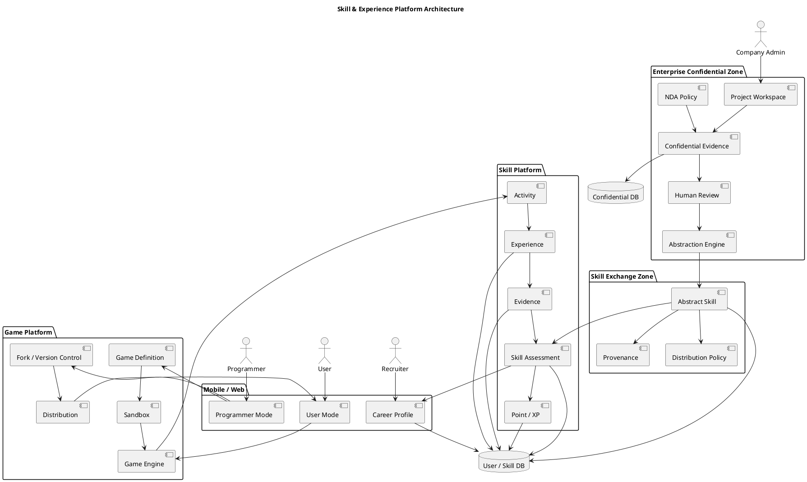

# Q1 在宅の女性プログラマ向け、ゲーム機能、ポイント機能がついた、便利グッズのアプリ(iphone, android)を作ろうと思います。参考にするとよいオープンソースがあれば８つ示してください。
A1 by chatgpt

はい。今回のアイデアは、

> **在宅で働く女性プログラマ向け × 便利グッズ × ゲーム × ポイント**

なので、単なる「便利グッズアプリ」よりも、**習慣化・ゲーミフィケーション・ポイント経済・モバイルUI・プライバシー**を別々のOSSから学ぶのがよいと思います。

特に **Flutter** を中心に見ると、iPhone/Androidをかなり共通化できます。

## おすすめ8プロジェクト

| # | OSS                            | 主に参考にする部分               | 今回との相性 |
| - | ------------------------------ | ----------------------- | ------ |
| 1 | **Table Habit / mhabit**       | 習慣・スコア・クロスプラットフォーム      | ★★★★★  |
| 2 | **Habit Tracker / rurfy**      | XP・レベル・Streak           | ★★★★★  |
| 3 | **HabitQuest**                 | XP・バッジ・認証・通知            | ★★★★★  |
| 4 | **gamification_ui**            | ポイント・レベル・バッジ・ランキングUI    | ★★★★★  |
| 5 | **Flutter Habit Tracker**      | ゲーム的演出・達成報酬             | ★★★★☆  |
| 6 | **Habit Tracker / sam-baraka** | XP・Level・Achievement・同期 | ★★★★☆  |
| 7 | **oomf**                       | トークン経済・ゲーム・Leaderboard  | ★★★★★  |
| 8 | **HabiTrack**                  | 作業時間→報酬という仕組み           | ★★★★★  |

---

## 1. Table Habit / mhabit

Table Habit

[GitHub: FriesI23/mhabit](https://github.com/FriesI23/mhabit?utm_source=chatgpt.com)

これはかなりおすすめです。

Flutter/Dart + SQLite + Providerで、Android/iOSだけでなくWindows、macOS、Linuxにも対応しています。特に面白いのが、単純な「連続○日」だけではなく**独自のスコアリングシステム**を持っていることです。また、オフライン優先、WebDAV同期、データを自分で管理する設計になっています。Apache 2.0です。([GitHub][1])

今回なら、

```text
便利グッズを使う
       ↓
タスク完了
       ↓
Score
       ↓
Level
       ↓
ポイント
```

という仕組みのベースにできます。

---

## 2. Habit Tracker / LevelUp Habits

[GitHub: rurfy/habit-tracker](https://github.com/rurfy/habit-tracker?utm_source=chatgpt.com)

これは**ゲーム化の実装を見る教材として非常に良い**です。

Flutter + Providerで、

* Streak
* XP
* Stats
* Level
* Local persistence
* Notification
* Unit test
* Widget test

などがあります。Android/iOS/Webで動かせる構成です。MIT Licenseです。([GitHub][2])

例えば今回なら、

```text
コードを書いた
      ↓
30分集中
      ↓
+10 XP
      ↓
100 XP
      ↓
Level Up!
```

という設計を研究できます。

---

## 3. HabitQuest

[GitHub: HabitQuest](https://github.com/nalugala-vc/HabitQuest?utm_source=chatgpt.com)

こちらは、

**Flutter + Firebase + GetX**

という構成です。

特に、

* Google Sign-in
* Email/Password
* Firestore
* Authentication
* XP
* Badge
* Streak
* Notification
* Offline support
* Push notification

まで入っているので、**実際のサービス型アプリの構成**を見るのに向いています。([GitHub][3])

今回、

```text
利用者
 ↓
ログイン
 ↓
今日の便利グッズ
 ↓
ミッション
 ↓
ポイント
 ↓
バッジ
```

とするなら、かなり参考になります。

---

## 4. gamification_ui

[GitHub: keishidev/gamification_ui](https://github.com/keishidev/gamification_ui?utm_source=chatgpt.com)

これは特に注目です。

**GamificationそのものをUI部品として切り出したFlutterライブラリ**です。

例えば、

* Achievement badge
* Badge grid
* Unlock notification
* Streak
* Points
* XP bar
* Level card
* Points history
* Tier badge
* Leaderboard

などを対象にしています。現在はEarly Developmentです。([Ithub][4])

今回のアプリの、

```text
┌────────────────────┐
│ Level 12            │
│ ███████████░░  82% │
│                    │
│ ★ 1,240 points     │
│ 🔥 7 days streak   │
└────────────────────┘
```

のような画面を設計するときに参考になります。

---

## 5. Flutter Habit Tracker

[GitHub: PHom798/Flutter-Habit-Tracker](https://github.com/PHom798/Flutter-Habit-Tracker?utm_source=chatgpt.com)

これは**「楽しいUI」**の研究に向いています。

特徴的なのが、

* 50種類以上のEmoji/Color
* 5段階Achievement
* Confetti
* Animation
* Diamond explosion

などです。Flutter Animationやgamified UXの学習用として作られています。([GitHub][5])

今回の「便利グッズアプリ」なら、例えば、

> 「今日の便利グッズを3つ試した！」

といったときに、**ゲームらしい達成演出**を入れる参考になります。

---

## 6. Habit Tracker / sam-baraka

[GitHub: sam-baraka/habit_tracker](https://github.com/sam-baraka/habit_tracker?utm_source=chatgpt.com)

これもFlutterです。

面白いのは、

* Authentication
* Habit tracking
* Progress visualization
* Offline
* Data synchronization
* XP
* Levels
* Achievements

をまとめて持っているところです。([GitHub][6])

つまり、

```text
User
 │
 ├─ Habit
 │
 ├─ XP
 │
 ├─ Level
 │
 └─ Achievement
```

というデータモデルを考える参考になります。

---

## 7. oomf

[GitHub: Varun-Dudipala/oomf](https://github.com/Varun-Dudipala/oomf?utm_source=chatgpt.com)

これは今回のアイデアに**意外とかなり近い**です。

React Native + Expo + Supabaseで、ゲーム要素として、

* Tokens
* Hints
* Levels
* Badges
* Streak
* Weekly Leaderboard
* Token economy

を持っています。([GitHub][7])

特に参考になるのは、

```text
活動
 ↓
Tokenを獲得
 ↓
Tokenを使う
 ↓
便利な機能をアンロック
```

という**ポイント経済**です。

今回のアプリなら、

```text
仕事をする
   ↓
ポイント獲得
   ↓
便利グッズを購入
   ↓
さらに仕事が楽になる
```

という循環を作れます。

---

## 8. HabiTrack

[GitHub: king04aman/HabiTrack](https://github.com/king04aman/HabiTrack?utm_source=chatgpt.com)

これは今回のアイデアにかなり面白いヒントがあります。

**仕事をした時間を「報酬」に変換する**仕組みです。

例えば、

```text
30分仕事
   ↓
10分のReward
```

というWork-to-Reward比率を設定できます。デスクトップの活動を記録し、モバイルアプリと同期する構成です。Android/iOS向けモバイルアプリもReact Nativeで実装されています。([GitHub][8])

今回なら、

```text
コーディング30分
       ↓
+30 Point
       ↓
「便利グッズ」抽選券
       ↓
ゲーム
```

などに発展できます。

---

# 私なら8個をこう使い分けます

単純に8個を全部読む必要はありません。

```text
                 今回作るアプリ
                       │
       ┌───────────────┼───────────────┐
       │               │               │
       ▼               ▼               ▼
    習慣化           ゲーム化        ポイント経済
       │               │               │
       ▼               ▼               ▼
  mhabit          gamification_ui     oomf
  LevelUp        Flutter Habit       HabiTrack
  HabitQuest     Tracker
```

さらに、

```text
                  アプリ基盤
                      │
             ┌────────┴────────┐
             ▼                 ▼
          Flutter          Firebase/
                            Supabase
             │                 │
          iPhone            Backend
          Android
```

という構成を研究します。

---

# 特に「在宅女性プログラマ向け」なら

ここは普通のHabit Trackerとは少し違う設計にしたほうが面白いと思います。

例えば、

### 「仕事」だけをゲーム化しない

```text
コーディング
レビュー
テスト
ドキュメント
学習
休憩
運動
家事
```

などを**全部「生活をうまく回す活動」**として扱う。

例えば、

```text
┌─────────────────────────┐
│        Today's Quest    │
├─────────────────────────┤
│                         │
│ 💻 コーディング  +30    │
│ 🧪 テスト       +20    │
│ 📚 技術書       +15    │
│ ☕ 休憩          +10    │
│ 🧘 ストレッチ    +10    │
│                         │
│       Total: 85 P      │
└─────────────────────────┘
```

そしてポイントを、

```text
85 P
 ↓
┌───────────────────────┐
│ 交換できるもの         │
├───────────────────────┤
│ ☕ コーヒー休憩        │
│ 🎮 ゲーム時間          │
│ 📚 技術書              │
│ 🪑 デスク用品          │
│ 🧹 家事スキップ券      │
└───────────────────────┘
```

のようにする。

**「仕事を効率化するアプリ」ではなく、「在宅ワークの生活全体をゲーム化するアプリ」**にすると、かなり独自性が出ます。

そして技術的には、最初は **Flutter + SQLite/Drift + Firebase/Supabase** あたりで小さく始め、後からポイントサーバー、ランキング、イベント、AIによる便利グッズ推薦などを追加する構成が扱いやすいです。

なお、Flutter公式にもiOSのGame CenterとAndroidのGoogle Play Games Servicesを使ったAchievements/Leaderboardsの実装例があります。自前ランキングとOS標準ゲーム実績をどう使い分けるかを考える際の参考になります。([docs.flutter.dev][9])

[1]: https://github.com/friesi23/mhabit?utm_source=chatgpt.com "GitHub - FriesI23/mhabit: Open-source Flutter habit tracker with smart scoring, WebDAV sync, local-first storage, privacy-focused design, and support for Android, iOS, Windows, macOS, and Linux. · GitHub"
[2]: https://github.com/rurfy/habit-tracker?utm_source=chatgpt.com "GitHub - rurfy/habit-tracker: Gamified habit tracker built with Flutter. Track streaks, earn XP, and level up your life. · GitHub"
[3]: https://github.com/nalugala-vc/HabitQuest?utm_source=chatgpt.com "GitHub - nalugala-vc/HabitQuest: A Flutter-based cross-platform (Android, iOS, and Web) Gamified Habit Tracker App that encourages users to build and maintain habits through gamification. The app includes features like habit creation, progress tracking with streaks, XP and badges, offline-first functionality, reminders, and a responsive light/dark theme. · GitHub"
[4]: https://ithub.global.ssl.fastly.net/keishidev/gamification_ui?utm_source=chatgpt.com "GitHub - keishidev/gamification_ui: Headless gamification UI components for Flutter: achievements, streaks, points, and leaderboards. Bring your own state. · GitHub"
[5]: https://github.com/PHom798/Flutter-Habit-Tracker?utm_source=chatgpt.com "GitHub - PHom798/Flutter-Habit-Tracker: A vibrant habit tracking app featuring 50+ emojis/colors and a unique 5-level celebration system, including confetti and diamond explosions. Make habit tracking exciting! · GitHub"
[6]: https://github.com/sam-baraka/habit_tracker?utm_source=chatgpt.com "GitHub - sam-baraka/habit_tracker: Habit tracker app · GitHub"
[7]: https://github.com/Varun-Dudipala/oomf?utm_source=chatgpt.com "GitHub - Varun-Dudipala/oomf: Anonymous compliments social app - React Native, Expo, Supabase · GitHub"
[8]: https://github.com/king04aman/HabiTrack?utm_source=chatgpt.com "GitHub - king04aman/HabiTrack: HabiTrack is an open-source productivity monitoring and mobile usage control system that boosts focus by tracking desktop activity in IDEs (VSCode, IntelliJ) and rewarding productive work with controlled smartphone access. Enhance your work-life balance, minimize distractions, and build better habits with real-time sync and gamification features. · GitHub"
[9]: https://docs.flutter.dev/cookbook/games/achievements-leaderboard?utm_source=chatgpt.com "Add achievements and leaderboards to your mobile game"

#  Q2 スキル判定と転職時にも役立つ経験とスキルの記録機能をつけることを前提に、再度、オープンソースで１種類紹介してください。
A2

はい。今回の条件なら、**1つだけ選ぶなら `HowProgrammingWorks/SelfAssessment`** を強くおすすめします。

GitHub 上のOSSで、まさに **「プログラマのスキルを自己評価し、時系列で記録し、職種との適合度を見る」** ことを目的にしています。700以上のマイクロスキルを持ち、Node.js、データベース、アーキテクチャなどを含みます。さらに、単なる自己申告だけでなく「使った」「説明できる」「研究した」「実装した」など、経験の深さを段階化しています。([GitHub](https://github.com/HowProgrammingWorks/SelfAssessment) ([GitHub][1]))

[HowProgrammingWorks/SelfAssessment](https://github.com/HowProgrammingWorks/SelfAssessment?utm_source=chatgpt.com)

### 今回のアプリへの取り込み方

このOSSの考え方を、先ほどの

**「在宅女性プログラマ向け × 便利グッズ × ゲーム × ポイント」**

に組み合わせると、かなり面白くなります。

```text
             日々の活動
                 │
        ┌────────┴────────┐
        ▼                 ▼
    仕事の経験          学習経験
        │                 │
        └────────┬────────┘
                 ▼
             Skill記録
                 │
        ┌────────┼────────┐
        ▼        ▼        ▼
     技術力    経験量    実践度
        │        │        │
        └────────┼────────┘
                 ▼
            Skill Level
                 │
        ┌────────┼────────┐
        ▼        ▼        ▼
      Points   Badge    Career
                         │
                         ▼
                    転職用Profile
```

特に重要なのは、**「Pythonを知っています」だけではなく、「Pythonを実際のプロジェクトで使った」という証拠を残す**ことです。

例えば、

| Skill  | 経験         | Level |
| ------ | ---------- | ----: |
| Python | 業務で3プロジェクト |     4 |
| C      | 組込み開発      |     5 |
| Git    | 日常的に使用     |     4 |
| Docker | 個人プロジェクト   |     3 |
| UML    | 設計・教育で使用   |     4 |
| AWS    | 学習のみ       |     2 |

さらに、

```text
Python
  │
  ├── 学習 20時間
  ├── プロジェクト 3件
  ├── GitHub repository 5件
  ├── Code Review 12回
  ├── 技術記事 8件
  └── 実務経験 2年
```

のように**経験の証拠（Evidence）**を紐付けると、転職時に非常に強いプロフィールになります。

GitHub自身も、転職時にはプロフィール、Skills、Professional Experience、Projects、Achievementsなどを整理し、実際のOSSへの貢献も示すことを推奨しています。([GitHub Docs][2])

### さらに今回のアプリなら

ここにゲーム要素を入れます。

```text
「Pythonを勉強した」
        ↓
     +10 XP

「Pythonで小さなプログラムを作った」
        ↓
     +30 XP

「実プロジェクトで使った」
        ↓
     +100 XP

「他人のコードをレビューした」
        ↓
     +80 XP

「技術記事を書いた」
        ↓
     +50 XP
```

すると、

> **自己評価 → 実際の経験 → スキル上昇 → ポイント → バッジ → 転職用プロフィール**

という循環ができます。

これは先ほど挙げた8プロジェクトの中にはなかった、**「ゲーム」と「キャリア証明」を結合する核**になります。

なお、別のOSSでは **Stride Open Competency Matrix** も非常に参考になります。これはソフトウェアエンジニアのCompetency MatrixをJSONで構造化し、レベル・スキル・テーマを持たせる設計です。([GitHub][3])

なので私は、

**ゲーム部分 → HabitQuest / gamification_ui系**

**スキル判定・キャリア部分 → SelfAssessment**

**スキル体系 → Stride Open Competency Matrix**

という3つを組み合わせる設計をおすすめします。

そして今回のアプリの**中心データモデル**は、

```text
User
 │
 ├── Activity
 │      ├── Work
 │      ├── Learning
 │      └── Project
 │
 ├── Experience
 │
 ├── Skill
 │      └── SkillLevel
 │
 ├── Evidence
 │
 ├── Point
 │
 ├── Badge
 │
 └── CareerProfile
```

とすると、**「便利グッズアプリ」から「在宅プログラマの生活・成長・キャリアを記録するアプリ」**へ発展させられます。これはかなり筋のいい方向だと思います。

[1]: https://github.com/HowProgrammingWorks/SelfAssessment?utm_source=chatgpt.com "GitHub - HowProgrammingWorks/SelfAssessment: Software engineering self assessment · GitHub"
[2]: https://docs.github.com/en/account-and-profile/tutorials/using-your-github-profile-to-enhance-your-resume?utm_source=chatgpt.com "Using your GitHub profile to enhance your resume - GitHub Docs"
[3]: https://github.com/stride-so/matrix?utm_source=chatgpt.com "GitHub - stride-so/matrix: Open-source software engineering competency and career plans. · GitHub"

# Q3 この企画の派生として、小説家とのタイアップを検討しており、学園ものとしての涼宮ハルヒ、異世界ものとしての精霊の守り人を想定した筋書きを用意しようとしています。別々にタイアップする案と、合体させる案の２つを作ってください。
A3 

もちろんです。これは企画としてかなり面白いと思います。

ただし、**『涼宮ハルヒ』と『精霊の守り人』はいずれも著作権で保護された作品**なので、実際のタイアップには権利者との正式な許諾が必要です。『涼宮ハルヒ』は谷川流氏原作・いとうのいぢ氏キャラクター原案の作品で、KADOKAWAが公式に展開しています。([KADOKAWAオフィシャルサイト][1]) 『精霊の守り人』を含む「守り人」シリーズは上橋菜穂子氏の作品です。([講談社][2])

そこで以下では、**実際のキャラクターや既存の物語をそのまま再現するのではなく、正式タイアップを想定した企画書レベルの「筋書き」**として考えます。

---

# 案A：別々にタイアップする

まず私は、**最初はこちらを推します**。

理由は、作品ごとの世界観を壊さず、アプリの利用者層を2方向から獲得できるからです。

---

## A-1 『涼宮ハルヒ』タイアップ版

### 「放課後・未来創造プログラム」

公式作品の特徴である「宇宙人・未来人・超能力者などが関わる非日常系学園」という方向性を活用します。([KADOKAWAオフィシャルサイト][1])

### 世界観

利用者は高校生。

学校生活の中で、

* プログラミング
* 勉強
* 部活
* 読書
* 友達との活動
* 文化祭
* 探索
* 新しいことへの挑戦

などを「ミッション」として実行します。

ただし、普通の学園生活ではありません。

---

### ストーリー

ある日、学校の掲示板に、

> **「あなたの毎日の行動が、未来を変える」**

という謎のプログラムが出現します。

利用者が、

```text
数学を勉強する
       ↓
+20 XP

プログラミングする
       ↓
+50 XP

誰かにプログラミングを教える
       ↓
+80 XP

新しいことに挑戦する
       ↓
+100 XP
```

と活動するたびに「未来ポイント」が蓄積されます。

一定量を超えると、学校内で起こるイベントが変化します。

---

### 面白い仕掛け

**利用者全員のポイントが世界を変える。**

例えば、

```text
全国ユーザー
      ↓
今週の総ポイント
      ↓
1,000,000 XP
      ↓
「未来イベント」発生
```

とします。

つまり、

> **一人の努力がゲームを変え、みんなの努力が物語を変える。**

これはSNSとの相性も非常に良いです。

---

## スキル機能との接続

ここで現在企画しているアプリの本来の機能が生きます。

```text
数学
 ↓
問題を解いた
 ↓
経験記録
 ↓
Skill +1

Python
 ↓
プログラムを作った
 ↓
Evidence
 ↓
Skill +1
```

卒業すると、

```text
School Career Record
        ↓
Skill Profile
        ↓
将来の進路
```

になります。

つまり、

**ゲームの記録が、そのままキャリアの記録になる。**

ここはかなり強いと思います。

---

# A-2 『精霊の守り人』タイアップ版

### 「守りの技術者」

こちらは学園ゲームではなく、**異世界での「技術・知識・経験の継承」**を中心にします。

『精霊の守り人』を含む「守り人」シリーズは、異なる文化・生命・人々の関係を背景にした物語世界を持っています。上橋氏自身も文化人類学を背景に物語を創作してきたことを語っています。([講談社][2])

---

## ストーリー

利用者は異世界の小さな町に住む新人。

町には、

```text
薬師
鍛冶師
狩人
料理人
商人
学者
護衛
技術者
```

など様々な職業があります。

ところが、町の知識が少しずつ失われています。

そこで利用者は、

> **「誰かが知っている技術を、次の世代に残す」**

という使命を与えられます。

---

## ゲーム構造

例えば、

```text
薬草を調べる
       ↓
知識 +10

薬を作る
       ↓
経験 +30

師匠から教わる
       ↓
Skill取得

他の人に教える
       ↓
Knowledge +50
```

となります。

そして重要なのが、

### 「経験を独占しない」

こと。

```text
自分だけが知っている
        ↓
Knowledge

誰かに教える
        ↓
Shared Knowledge

複数人が使える
        ↓
Community Skill
```

という仕組みにします。

---

# B案：『涼宮ハルヒ』×『精霊の守り人』を合体

こちらは、**正式なクロスオーバー許諾が得られた場合だけ成立する企画**として考えます。

そして、単純に

> 学園＋異世界

にするより、もっと面白い設定があります。

---

# 「境界世界プロジェクト」

### 基本設定

現代の学校と異世界が、突然つながります。

```text
        現代世界
           │
       学校・IT
           │
           │
      ──境界──
           │
           │
       異世界
           │
      伝統・自然・知識
```

現代側には、

**情報技術・プログラミング・AI**

があります。

異世界側には、

**自然・文化・経験・伝承**

があります。

---

# ストーリーの核心

ある日、

> **「世界から失われつつある知識」**

を保存する必要が生じます。

ところが、

```text
現代側
    ↓
デジタル技術は強い
    ↓
しかし経験を知らない

異世界側
    ↓
経験・伝承は豊富
    ↓
しかし記録技術が弱い
```

という問題があります。

そこで両世界の若者が協力します。

---

# アプリそのものが物語になる

ここが、この企画の一番面白いところです。

利用者はアプリを使って、

```text
Quest
 ↓
Experience
 ↓
Skill
 ↓
Knowledge
 ↓
Points
 ↓
Story
```

を蓄積します。

例えば、

### Quest 001

> 「異世界の薬草について調査せよ」

↓

### Quest 002

> 「薬草を使った薬を作れ」

↓

### Quest 003

> 「その知識を他の利用者に伝えよ」

↓

### Quest 004

> 「現代の科学的知識と比較せよ」

↓

### Quest 005

> 「両方の知識を使って新しい方法を考えよ」

となります。

---

# すると「スキル判定」が物語の一部になる

例えば、

```text
Skill Tree

観察
 │
 ├── 植物
 │    ├── 薬草
 │    └── 食物
 │
 ├── 科学
 │    ├── 化学
 │    └── 生物
 │
 └── 技術
      ├── Programming
      └── Data Analysis
```

利用者が実際に活動することでSkill Treeが成長します。

---

# さらに「転職機能」が物語につながる

これは今回の企画ならぜひ残したいです。

ゲーム終了時に、

```text
あなたの冒険記録
       ↓
━━━━━━━━━━━━━━
Programming      Lv.8
Data Analysis    Lv.6
Communication    Lv.7
Leadership       Lv.5
Research         Lv.8
━━━━━━━━━━━━━━
Quest completed      126
Projects              18
Knowledge shared      42
Mentoring              9
━━━━━━━━━━━━━━
```

という**「冒険者履歴書」**を生成します。

現実世界では、

> **職務経歴書 / Skill Profile**

になります。

異世界では、

> **冒険者の実績書**

になります。

---

# 3案を比較すると

|       | ハルヒ単独  | 守り人単独     | クロスオーバー   |
| ----- | ------ | --------- | --------- |
| 世界観   | 学園・非日常 | 異世界・文化・生命 | 現代×異世界    |
| ゲーム性  | ★★★★★  | ★★★★☆     | ★★★★★     |
| 学習    | ★★★★☆  | ★★★★★     | ★★★★★     |
| スキル判定 | ★★★★★  | ★★★★★     | ★★★★★     |
| キャリア  | ★★★★★  | ★★★★☆     | ★★★★★     |
| SNS   | ★★★★★  | ★★★★☆     | ★★★★★     |
| ストーリー | ★★★★☆  | ★★★★★     | ★★★★★     |
| 実装容易性 | 高      | 中         | 低         |
| 権利調整  | 作品ごと   | 作品ごと      | **2作品同時** |

---

# 私なら「3段階」にします

いきなりクロスオーバーにしません。

```text
Phase 1
オリジナル版
   ↓
「Skill Quest」

Phase 2
     ┌──────────────┐
     ↓              ↓
学園版           異世界版
   ハルヒ          守り人
     ↓              ↓
     └──────┬───────┘
            ↓
Phase 3
     クロスオーバー
「境界世界プロジェクト」
```

これなら、**最初は作品権利に依存せずアプリそのものを成立させられます**。

そしてタイアップが成立した場合だけ、世界観・キャラクター・固有設定を正式に組み込む。

特にこの企画では、

> **「ゲームで遊ぶ」→「経験が残る」→「スキルが可視化される」→「他人に教える」→「キャリアとして証明できる」**

という本体の仕組みがあり、そこへ物語を載せるのが重要です。

『精霊の守り人』側については、単なる「異世界RPG」にしてしまうより、**知識・経験・技能を次の世代へ伝える**というテーマを中心に置くと、今回の「経験とスキルの記録」というアプリ本体と非常に自然につながります。上橋氏自身も「物語ること、生きること」で、読むこと・書くこと・生きることの関係や、物語が生まれるまでの道程を語っています。([講談社コクリコ｜講談社][3])

一方、ハルヒ側は、公式にも「宇宙人×未来人×超能力者」の非日常系学園ストーリーとして紹介されているので、**「日常の行動が非日常を発生させる」ゲーム設計**との相性がよいです。([KADOKAWAオフィシャルサイト][1])

[1]: https://www.kadokawa.co.jp/product/200877000035/?utm_source=chatgpt.com "「涼宮ハルヒの憂鬱(1)」谷川流 [角川コミックス・エース] - KADOKAWA"
[2]: https://www.kodansha.co.jp/book/products/0000209650?utm_source=chatgpt.com "『物語ること、生きること』（上橋　菜穂子,瀧　晴巳）｜講談社"
[3]: https://cocreco.kodansha.co.jp/aoitori/aoitoribooks/0000209650?utm_source=chatgpt.com "物語ること、生きること - 青い鳥文庫"

# Q4 さらに２つの要素を検討しています。一つは、ゲームには、利用者モードと、ゲームのプログラムを改変するプログラマモードに分けて、改良したプログラムを配布できるようにして、利用者が多ければポイントとスキルがたまるようにする。二つ目は、機密保持契約を結んだプロジェクトの間で、少し抽象化したスキルを取り込む機能です。ここでは、セキュリティ、業務での契約を含めて、細かく検討したいです。
A4 

はい。ここはかなり重要な分岐点だと思います。

これまでの企画に今回の2要素を加えると、単なる「ゲーム付きスキル管理アプリ」ではなく、

> **個人の経験・スキルを蓄積し、OSS的にゲームを改良・共有し、さらに企業間では機密を漏らさずにスキル知識を共有する「Skill & Experience Platform」**

に発展します。

ただし、**「プログラムを自由に改変して配布」**と**「NDA下の企業情報を抽象化して共有」**は、セキュリティ・知財・契約上かなり性質が違います。ここを最初から分離して設計するのが重要です。

---

# 1. まず全体像

私は次の4つの領域に分けます。

```text
                         Skill Platform
                              │
        ┌─────────────────────┼─────────────────────┐
        │                     │                     │
        ▼                     ▼                     ▼
   User Mode             Programmer Mode       Enterprise Mode
   利用者モード             開発者モード           企業モード
        │                     │                     │
        │                Game Program              │
        │                改変・作成                │
        │                     │                     │
        │                     ▼                     │
        │                Distribution              │
        │                     │                     │
        ▼                     ▼                     ▼
     Game                 Game Fork             Abstract Skill
        │                     │                     │
        └──────────────┬──────┴─────────────────────┘
                       ▼
                 Experience
                       │
                       ▼
                     Skill
                       │
                       ▼
                    Points
                       │
                       ▼
                Career Profile
```

ここで重要なのは、

**企業秘密そのものを「Skill」に変換するのではなく、企業秘密から切り離した「抽象化されたSkill Evidence」を作る**

ことです。

---

# 2. 要素①：利用者モードとプログラマモード

これは非常に面白い仕組みです。

## 利用者モード

普通の利用者は、

```text
Game
 ↓
Quest
 ↓
Action
 ↓
Experience
 ↓
Point
 ↓
Skill
```

だけを使います。

例えば、

> 「Pythonでデータを加工する」

というQuestを実行すると、

```text
Experience
    ↓
Python
Data Processing
    ↓
+50 XP
```

となります。

---

# 3. プログラマモード

こちらではゲームそのものを変更できます。

```text
Programmer Mode

Game Source
     │
     ├── Rule
     ├── Quest
     ├── UI
     ├── Scoring
     ├── Skill Mapping
     └── Event
          │
          ▼
       Modify
          │
          ▼
       Test
          │
          ▼
      Publish
          │
          ▼
     Game Repository
```

例えば、

### Version 1

```text
Python問題を10問解く
        ↓
100 Point
```

を、

### Version 2

```text
Python問題
 + GitHubへの実装
 + Code Review
        ↓
300 Point
```

に改良する。

---

# 4. ここで重要なのが「Fork」です

GitHubのように、

```text
Original Game
       │
       ├──── Fork A
       │
       ├──── Fork B
       │
       └──── Fork C
```

とします。

利用者が、

> 「このゲームのほうが面白い」

と思えばFork版を利用できます。

さらに、

```text
Fork A
 ↓
利用者 100人
 ↓
1,000 Play
 ↓
高評価
```

なら、その改良者にポイントを与える。

---

# 5. ただし「利用者数＝ポイント」は危険

ここはかなり重要です。

単純に、

```text
利用者100人
 ↓
作者10,000 Point
```

としてしまうと、

* Bot
* 複数アカウント
* 自動実行
* 不正アクセス
* ゲームをわざと簡単にする
* 自分で大量利用者を作る

などでポイントを稼げます。

したがって、

> **利用者数ではなく「信頼できる利用実績」に対してポイントを付与する**

のがよいです。

例えば、

```text
Game Contribution Score

Unique Active Users
×
Completion Rate
×
Retention
×
Rating
×
Difficulty
×
Verified Usage
```

のようにする。

---

# 6. ポイントとスキルを分離する

ここも重要です。

```text
                  Activity
                     │
             ┌───────┴───────┐
             ▼               ▼
          Game XP        Evidence
             │               │
             ▼               ▼
          Points          Skill
```

つまり、

**Point ≠ Skill**

です。

例えば、

> 人気ゲームを作った

なら、

```text
Game Design Skill +1
Software Engineering Skill +1
Community Contribution +1
```

など。

一方、

> 100万人に使われた

なら、

```text
Impact Evidence
```

が増える。

これによって転職時に、

> 「ポイントを12,000持っています」

ではなく、

> 「作成したゲームが2,400人に利用され、改善版を7回公開し、ユーザー評価4.6/5を獲得した」

と証明できます。

**こちらのほうが圧倒的にキャリア価値があります。**

---

# 7. プログラム配布のセキュリティ

ここは通常のSNSより難しくなります。

利用者がプログラムをアップロードできるなら、

```text
User
 ↓
Upload Program
 ↓
Sandbox
 ↓
Static Analysis
 ↓
Dependency Analysis
 ↓
Test
 ↓
Security Scan
 ↓
Review
 ↓
Publish
```

とする必要があります。

特に**サーバー上で任意コードを直接実行させない**ことが最重要です。

IPAもWebアプリケーションについて、OSコマンドインジェクション、パス・トラバーサル、XSS、CSRF、アクセス制御欠落などを主要な脆弱性として挙げています。([情報処理推進機構][1])

したがって、

```text
                Untrusted Code
                     │
                     ▼
              ┌─────────────┐
              │ Sandbox     │
              │             │
              │ CPU limit   │
              │ Memory limit│
              │ Network OFF │
              │ File limit  │
              │ Time limit  │
              └─────────────┘
                     │
                     ▼
                Game Engine
```

のような境界が必要です。

---

# 8. さらに「Game Engine」と「Game Data」を分離する

私はここをかなり強くおすすめします。

```text
Game Engine
    │
    │ 安全な固定プログラム
    │
    ▼
Game Definition
    │
    ├── Quest
    ├── Rules
    ├── Points
    ├── Skill Mapping
    └── Story
```

つまり、最初から「任意のPython/JavaScriptを実行するゲーム」にしない。

例えば、

```json
{
  "quest": "python_review",
  "difficulty": 3,
  "point": 50,
  "skills": [
    "python",
    "code_review"
  ]
}
```

のような**宣言型ゲーム定義**にする方法があります。

これなら安全性がかなり高くなります。

---

# 9. 要素②：NDAプロジェクト間のスキル共有

こちらはさらに面白いです。

ただし、

> **NDAで知った情報を、そのままアプリに入力してはいけない**

という原則を置きたいです。

企業の営業秘密は、日本の不正競争防止法上、少なくとも「有用性」「秘密管理性」「非公知性」の3要件を満たす情報として扱われます。([経済産業省][2])

---

# 10. そこで「秘密情報」と「抽象Skill」を二層にする

例えばA社で、

```text
秘密情報

顧客Xのシステムでは
○○という特殊なアルゴリズムを
△△という構成で使用している。
```

という情報があったとします。

これは外部に出してはいけない。

そこで社内のSkill抽象化処理を、

```text
秘密情報
    │
    ▼
Human Review
    │
    ▼
Abstraction
    │
    ▼
Generic Skill
```

とします。

例えば、

```text
「顧客Xで○○を使った」
```

ではなく、

```text
「分散システムの性能最適化」
```

というSkillにする。

---

# 11. 抽象化にはレベルを設ける

私は5段階くらいがよいと思います。

| Level | 情報               | 外部共有  |
| ----- | ---------------- | ----- |
| L0    | 公開情報             | ◎     |
| L1    | 一般化されたSkill      | ◎     |
| L2    | 抽象化されたExperience | ○     |
| L3    | 企業固有のSkill       | △     |
| L4    | NDA情報            | ×     |
| L5    | 営業秘密・個人情報        | **×** |

例えば、

```text
L5
「A社の顧客Bのシステムで○○を実施」
```

↓

```text
L4
「大規模顧客システムで○○を実施」
```

↓

```text
L3
「大規模分散システムの性能改善経験」
```

↓

```text
L2
「分散システム性能改善」
```

↓

```text
L1
「Performance Optimization」
```

という変換です。

---

# 12. ただし「匿名化」だけでは不十分

ここは非常に重要です。

例えば、

```text
A社
↓
自動車会社
↓
日本の大手自動車会社
↓
某社
```

と名前を消しても、

```text
2025年
特殊な車載通信方式
特定のECU構成
特定の性能値
```

などが残っていれば、組み合わせから企業や案件を推測できる可能性があります。

したがって、

> **匿名化ではなく「目的に必要な最小限の抽象化」**

として設計したほうがよいです。

---

# 13. 企業ごとに「情報境界」を作る

アーキテクチャとしては、

```text
                 Skill Platform
                       │
       ┌───────────────┼───────────────┐
       │               │               │
       ▼               ▼               ▼
     User A          Company A       Company B
                       │               │
                  ┌────┴────┐     ┌────┴────┐
                  │ NDA DB  │     │ NDA DB  │
                  └────┬────┘     └────┬────┘
                       │               │
                       ▼               ▼
                  Abstractor       Abstractor
                       │               │
                       └───────┬───────┘
                               ▼
                         Public Skill
```

とします。

**Company AのNDA DBとCompany BのNDA DBは直接アクセスできない。**

---

# 14. 企業間共有には「Skill Exchange Zone」を置く

```text
Company A
    │
    │ NDA
    ▼
Confidential Zone
    │
    │ Human approval
    ▼
Abstraction Zone
    │
    │ Policy check
    ▼
Skill Exchange Zone
    │
    ├─────────────┐
    ▼             ▼
Company B       Public
```

ここで初めて外部へ出します。

---

# 15. 「誰が抽象化したか」を記録する

これも非常に重要です。

Skillだけ保存するのではなく、

```text
Abstract Skill
     │
     ├── Source Project
     ├── Owner Company
     ├── Reviewer
     ├── Approval Date
     ├── Abstraction Level
     ├── NDA Policy
     ├── Expiration
     └── Distribution Scope
```

を持たせます。

つまり**Skillそのものに来歴（Provenance）を付ける**。

---

# 16. 契約情報もデータモデルに入れる

ここは今回の企画の大きな特徴になります。

```text
Contract
 │
 ├── NDA
 ├── Employment Agreement
 ├── Project Agreement
 ├── IP Agreement
 ├── OSS License
 └── Data Processing Agreement
```

そして、

```text
Skill
 │
 └── Evidence
       │
       └── Project
             │
             └── Contract
```

と関連付けます。

これによって、

> 「このSkillはどの契約に基づくプロジェクトで得られたものか？」

を追跡できます。

---

# 17. さらに「有効期限」が重要

NDAやプロジェクト契約は永遠とは限りません。

例えば、

```text
Skill Evidence
     │
     ├── valid_from
     ├── valid_until
     ├── confidentiality_level
     └── distribution_policy
```

とします。

例えば、

```text
2026-04-01
    │
    ▼
NDA Project
    │
    ▼
Skill created
    │
    ▼
2028-03-31 NDA expiration
```

となった場合、

**自動的に公開可能になるとは限らない**

ことにも注意します。

契約終了＝秘密情報が自動的に公知になる、とは限らないからです。

---

# 18. 個人情報も別軸で管理する

このアプリでは、

```text
Skill
Experience
Project
User
Employer
Career
```

が全部つながります。

これはかなり個人情報リスクが高い。

個人情報保護委員会の現行ガイドラインでは、個人データについてアクセス制御、識別・認証、不正アクセス防止などの技術的安全管理措置が示されています。([PPC][3])

したがって、

```text
Skill Visibility

Private
   ↓
Recruiter Only
   ↓
Team
   ↓
Company
   ↓
Community
   ↓
Public
```

という**公開範囲**をSkill/Evidence単位で持たせたいです。

---

# 19. ここまでを統合したアーキテクチャ



---

# 20. そして、私は「3種類の信頼」を分けたい

この企画では、これが非常に重要です。

### ① 技術的Trust

```text
このプログラムは安全か？
```

### ② 経験的Trust

```text
この人は本当にこのSkillを持っているか？
```

### ③ 契約的Trust

```text
この情報を公開してよいのか？
```

この3つを混ぜない。

```text
                Trust
                  │
       ┌──────────┼──────────┐
       ▼          ▼          ▼
   Technical   Evidence    Contract
     Trust       Trust       Trust
       │          │           │
    Sandbox    Skill証拠     NDA/IP
    Security   実績確認      公開範囲
```

---

# 21. HAZOPの観点でもかなり面白くなる

以前の11 Guide Wordsによる分析を、この新機能にも適用できます。

例えば、

| Guide Word | プログラム共有      | NDAスキル共有     |
| ---------- | ------------ | ------------ |
| No         | プログラムが配布されない | Skillが登録されない |
| More       | ポイント過剰付与     | 情報を出し過ぎる     |
| Less       | 機能不足         | 抽象化しすぎる      |
| As well as | 悪意あるコード追加    | 秘密情報が追加される   |
| Part of    | 一部コードだけ配布    | 一部だけ秘密情報     |
| Reverse    | 改変で意図と逆動作    | Skillの意味が逆転  |
| Other than | 別プログラム実行     | 別企業情報混入      |
| Early      | 未検査コード配布     | NDA終了前公開     |
| Late       | セキュリティ検査遅延   | 公開停止遅延       |
| Before     | 認証前に配布       | 契約確認前に共有     |
| After      | 公開後に問題発覚     | 契約終了後も公開     |

特に怖いのが、

> **「抽象化したから安全だと思っていたが、複数のSkillを組み合わせると元の企業やプロジェクトを推測できてしまう」**

というケースです。

これは今回の企画では、最初から**「再識別リスク」**として扱うべきだと思います。

---

# 22. したがって「企業向けモード」には4段階の承認を入れたい

```text
Project Data
     │
     ▼
① Classification
     │
     ▼
② Abstraction
     │
     ▼
③ Security Review
     │
     ▼
④ Contract / NDA Review
     │
     ▼
⑤ Publish
```

そして、

**①～④を通過しなければ⑤に進めない。**

さらに重要なのは、**AIに自動判定させて終わりにしない**ことです。

AIは、

> 「この情報には企業名らしき情報があります」

> 「このSkillの組み合わせから案件を推測できる可能性があります」

という**レビュー支援**には使えます。

しかし、

> 「AIが安全と判定したから公開」

にはしない。

---

# 23. 最終的には「Skill Passport」にできる

ここまでやると、アプリの最終形がかなり見えてきます。

```text
┌────────────────────────────────┐
│          Skill Passport        │
├────────────────────────────────┤
│                                │
│ Python             Lv.8        │
│ C/C++              Lv.7        │
│ Software Design    Lv.6        │
│ Security           Lv.5        │
│                                │
│ Projects             23        │
│ Experiences          87        │
│ Game Contributions   14        │
│ Open Source           9        │
│                                │
│ Verified Evidence    62        │
│                                │
│ ───────────────────────────── │
│                                │
│ Confidential Experience:       │
│  12 projects                   │
│                                │
│ Public Abstract Skills:        │
│  34 skills                     │
│                                │
└────────────────────────────────┘
```

ここで**企業名・顧客名・秘密の技術内容は見せずに、「何ができる人なのか」を証明する**。

これは転職市場だけでなく、

* フリーランス
* 社内異動
* プロジェクトアサイン
* 副業
* OSS活動
* 技術コミュニティ
* 教育
* リスキリング

にも使えます。

---

## 特に重要な設計原則

今回の2機能について、私は最初から次の**10個を制約**として置くことをおすすめします。

1. **利用者モードとプログラマモードは権限的に分離する**
2. **アップロードされたプログラムは信頼しない**
3. **ゲーム実行環境とホストOSを分離する**
4. **PointとSkillを別概念にする**
5. **SkillにはEvidenceを紐付ける**
6. **EvidenceにはProvenanceを持たせる**
7. **NDA情報と公開Skillを物理的/論理的に分離する**
8. **抽象化は自動公開ではなく、人間による承認を必要とする**
9. **Skillごとに公開範囲・契約・有効期限を持たせる**
10. **「匿名化したから安全」とはみなさず、組合せによる再識別を評価する**

特に9について、個人データの安全管理はリスクに応じて設計するという現在の個人情報保護委員会の考え方とも整合します。([PPC][4])

また、企業秘密については「秘密管理性・有用性・非公知性」が重要なので、**NDAを結んでいるだけで安全、あるいはNDA対象外なら自由に公開できる、と単純化しない**ほうがいいです。([経済産業省][2])

---

この企画は、ここまで来ると**「アプリ」だけでなく、かなり本格的なプラットフォーム設計**になっています。

次に進めるなら、私は **①「利用者モード／プログラマモード」の状態遷移図、②「NDAプロジェクト→抽象Skill→公開」の状態遷移図、③「Skill/Evidence/Contract/Point/Game」のER図**の3枚をPlantUMLで作り、さらにそこへ**HAZOP 11 Guide Wordsを適用して制約を洗い出す**のが非常に良いと思います。

[1]: https://www.ipa.go.jp/security/vuln/websecurity.html?utm_source=chatgpt.com "安全なウェブサイトの作り方 | 情報セキュリティ | IPA 独立行政法人 情報処理推進機構"
[2]: https://www.meti.go.jp/policy/economy/chizai/chiteki/trade-secret.html?utm_source=chatgpt.com "営業秘密～営業秘密を守り活用する～ （METI/経済産業省）"
[3]: https://www.ppc.go.jp/personalinfo/legal/guidelines_tsusoku/?utm_source=chatgpt.com "個人情報の保護に関する法律についてのガイドライン（通則編） ｜個人情報保護委員会"
[4]: https://www.ppc.go.jp/personalinfo/legal/guidelines_tsusoku/?referral=tanocchi-bluereturn&utm_source=chatgpt.com "個人情報の保護に関する法律についてのガイドライン（通則編） ｜個人情報保護委員会"

# Q5 さらに追加して、関連特許の検索と、従来にないアイデアであれば特許の申請書類を作成する。特許がむつかしそうであれば、論文検索し投稿論文案を作成する。さらに、仕様が役立ちそうであれば、規格検索し、国際規格案を作成するという３つの分岐をそろえたいです。
A5

はい。ここまで来ると、企画の中心を **「経験を記録するアプリ」から「経験を知財・論文・標準化まで発展させる知識循環プラットフォーム」** と捉え直すと、かなりきれいにまとまります。

私は3つの分岐を、**特許・論文・標準化を競合させるのではなく、成熟度に応じて分岐する仕組み**にすることをおすすめします。

## 1. 全体構想

```text
                         ┌──────────────────┐
                         │  日々の活動・経験 │
                         └────────┬─────────┘
                                  ↓
                         ┌──────────────────┐
                         │ Skill / Evidence │
                         └────────┬─────────┘
                                  ↓
                         ┌──────────────────┐
                         │   新規性評価     │
                         └────────┬─────────┘
                                  ↓
                  ┌───────────────┼───────────────┐
                  │               │               │
                  ↓               ↓               ↓
             技術的発明       学術的知見       共通仕様
                  │               │               │
                  ↓               ↓               ↓
              特許検索         論文検索         規格検索
                  │               │               │
                  ↓               ↓               ↓
             特許候補？       論文候補？       規格候補？
                  │               │               │
                  ↓               ↓               ↓
             特許出願案       投稿論文案       国際規格案
```

ただし、**AIが「特許になる」「特許にならない」と最終判断する設計にはしない**ほうがよいです。

AIは、

> 「関連文献・特許を調査して、新規性・進歩性・先行技術との関係を整理する」

ところまで。

最終的な出願判断は、本人・弁理士・知財部門などが行う、という役割分担にします。

---

# 2. 3つの分岐を詳しくする

## A. 特許ルート

### 「これは従来にない技術か？」

を調べます。

```text
Experience
   ↓
Technical Idea
   ↓
Patent Search
   ├── Google Patents
   ├── J-PlatPat
   ├── Espacenet
   └── WIPO PATENTSCOPE
   ↓
Prior Art Analysis
   ↓
┌───────────────┐
│ 新規性・進歩性 │
│ の可能性       │
└───────┬───────┘
        ↓
 Patent Candidate
        ↓
 Invention Disclosure
        ↓
 Patent Draft
```

ここで生成するのは、最初から正式な特許出願書ではなく、

### 「発明提案書」

にするのがよいでしょう。

例えば、

```text
発明名称
技術分野
背景技術
従来技術の問題
発明の目的
発明の構成
作用・効果
実施例
変形例
先行技術との差分
請求項候補
図面候補
```

まで生成する。

その後、専門家が確認して正式な出願書類にします。

---

# 3. 「特許検索」を経験記録とつなぐ

ここがこのアプリならではです。

例えばプログラマが、

> 「ゲームの利用実績からSkillを自動推定する方式」

を考えたとします。

すると、

```text
Project
 ↓
Experience
 ↓
New Idea
 ↓
Patent Search
 ↓
Related Patents
```

となります。

さらに検索結果を、

```text
Idea
 │
 ├── Similar Patent A
 ├── Similar Patent B
 ├── Similar Paper C
 └── Standard D
```

と関連付ける。

これによって、**「自分のアイデアがどこから来て、何と違うのか」**を残せます。

---

# 4. B. 論文ルート

特許としては弱いが、研究として面白い場合があります。

```text
Idea
 ↓
Patent Search
 ↓
「新規性・進歩性が弱い」
 ↓
Research Question
 ↓
Academic Literature Search
 ↓
Research Gap
 ↓
Experiment / Evaluation
 ↓
Paper Draft
```

ここでAIに、

* 論文検索
* 関連研究整理
* Research Gap抽出
* 仮説作成
* 実験計画
* 評価指標
* 論文構成

を支援させます。

---

# 5. 論文生成は「実験結果を捏造しない」が絶対条件

ここは非常に重要です。

AIが、

> 「実験したところ精度が95%になった」

などと勝手に書くのはNG。

したがってデータモデルを、

```text
Research
 │
 ├── Hypothesis
 ├── Method
 ├── Dataset
 ├── Experiment
 ├── Result
 └── Conclusion
```

と分け、

**Resultは実際の測定値からしか生成できない**

ようにします。

論文案は、

```text
Abstract
Introduction
Related Work
Method
Experiment
Results
Discussion
Conclusion
References
```

まで作れるようにします。

---

# 6. C. 国際規格ルート

これは今回の企画では、実はかなり面白いです。

例えば、

> 「Skillの表現方法を企業間で共通化できるのではないか？」

というアイデアが出たとします。

すると、

```text
Specification
 ↓
Standards Search
 ↓
ISO
IEC
IEEE
IETF
W3C
ETSI
AUTOSAR
etc.
 ↓
Gap Analysis
 ↓
Existing Standard?
 ↓
New Work Item?
 ↓
International Standard Proposal
```

となります。

---

# 7. 規格化候補の例

今回のアプリなら、例えば、

### Skill Evidence Format

```json
{
  "skill": "python",
  "level": 4,
  "evidence": [
    {
      "type": "project",
      "duration": "6 months"
    }
  ]
}
```

というデータ形式を考えられます。

これを、

> **「技術者の経験・Skill・Evidenceを相互運用可能な形式で表現する仕様」**

として標準化する。

これは単なるアプリ機能ではなく、**将来的には標準仕様候補**になり得ます。

---

# 8. さらに面白いのが「3分岐」ではなく「3段階」

私はここを、

```text
             Idea
               │
               ▼
          Prior Art Search
               │
       ┌───────┼────────┐
       │       │        │
       ▼       ▼        ▼
     Patent   Paper   Standard
       │       │        │
       └───────┼────────┘
               ▼
            Knowledge
```

だけにするより、

### 「どの社会的成果に向いているか」

を判定する仕組みにします。

---

# 9. 例えばこんな判定

| 特徴       | 特許 | 論文 | 規格 |
| -------- | -: | -: | -: |
| 技術的な新規性  |  ◎ |  ○ |  ○ |
| 実装方法が重要  |  ◎ |  ○ |  △ |
| 理論・評価が重要 |  △ |  ◎ |  △ |
| 実験結果が重要  |  △ |  ◎ |  ○ |
| 複数企業が使う  |  ○ |  ○ |  ◎ |
| 相互運用性が重要 |  △ |  ○ |  ◎ |
| 独占したい    |  ◎ |  × |  × |
| 広く普及させたい |  ○ |  ○ |  ◎ |

例えば、

> **新しいアルゴリズム**

なら、

**特許 → 論文**

の順。

> **複数企業でSkill情報を交換するデータ形式**

なら、

**論文 → 規格**

の順。

> **既存技術を組み合わせた新しい業務方法**

なら、

**特許 → 論文**

を検討。

---

# 10. さらに「特許→論文→規格」の連鎖も許す

ここが一番面白いところです。

```text
                 Idea
                  │
                  ▼
             Patent Search
                  │
                  ▼
             Patent Draft
                  │
                  │
                  ▼
              Research
                  │
                  ▼
             Academic Paper
                  │
                  │
                  ▼
             Specification
                  │
                  ▼
           International
             Standard
```

例えば、

**① 発明**

「Skill Evidenceからスキルを推定するアルゴリズム」

↓

**② 特許**

アルゴリズムの新規部分を出願

↓

**③ 論文**

実験結果を論文化

↓

**④ 標準化**

Skill Evidenceを交換するデータモデルを標準化

という流れです。

---

# 11. 逆方向も重要

実は、

```text
Standard
   ↓
Implementation
   ↓
Experience
   ↓
Improvement
   ↓
Patent
```

もあります。

例えばISO/IEC規格を実装してみたら、

> 「既存規格ではこの部分が扱えない」

と分かる。

↓

改善案を作る。

↓

特許になる可能性を調べる。

↓

論文を書く。

↓

規格改訂提案をする。

これは**技術者の実務経験から標準化までつながる非常に良い循環**です。

---

# 12. これまでの企画を全部統合すると

かなり大きなシステムになります。

```text
                         ┌─────────────┐
                         │    User     │
                         └──────┬──────┘
                                │
                ┌───────────────┴───────────────┐
                │                               │
                ▼                               ▼
          User Mode                       Programmer Mode
                │                               │
                ▼                               ▼
             Game                         Game Development
                │                               │
                └───────────────┬───────────────┘
                                ▼
                            Activity
                                │
                                ▼
                           Experience
                                │
                                ▼
                             Evidence
                                │
                         ┌──────┴──────┐
                         ▼             ▼
                       Skill        New Idea
                         │             │
                         ▼             ▼
                       Point      Prior Art Search
                         │             │
                         │       ┌─────┼─────┐
                         │       ▼     ▼     ▼
                         │    Patent Paper Standard
                         │       │     │     │
                         │       ▼     ▼     ▼
                         │    Draft  Draft  Draft
                         │
                         ▼
                    Career Profile
```

そして企業プロジェクトは横から入ります。

```text
                  Enterprise Project
                         │
                    NDA / Contract
                         │
                         ▼
                 Confidential Evidence
                         │
                    Human Review
                         │
                    Abstraction
                         │
                         ▼
                  Abstract Skill
                         │
                         ▼
                      Skill
```

---

# 13. このシステムの「知識の流れ」

私は最終的には、これを**Knowledge Lifecycle**として設計したいです。

```text
        ┌────────── Experience ──────────┐
        │                                │
        ▼                                │
      Skill                              │
        │                                │
        ▼                                │
      Idea                               │
        │                                │
        ▼                                │
    Prior Art                            │
        │                                │
   ┌────┼────┐                           │
   ▼    ▼    ▼                           │
Patent Paper Standard                    │
   │    │    │                           │
   └────┼────┘                           │
        ▼                                │
    Knowledge                            │
        │                                │
        ▼                                │
   New Experience ───────────────────────┘
```

つまり、

> **経験 → 知識 → 発明・研究・標準化 → 新しい経験**

という循環です。

これができると、単なるSNSではなくなります。

---

# 14. セキュリティ・契約面では「4つの境界」を置きたい

今回の追加機能を考えると、最低でも、

```text
┌─────────────────────────────────┐
│ Public                           │
│                                   │
│ 公開Skill / OSS / 論文 / 規格     │
└────────────────┬────────────────┘
                 │
┌────────────────▼────────────────┐
│ Community                        │
│                                   │
│ ゲーム / プログラム / コラボ      │
└────────────────┬────────────────┘
                 │
┌────────────────▼────────────────┐
│ Career                           │
│                                   │
│ 個人経験 / Skill / Evidence       │
└────────────────┬────────────────┘
                 │
┌────────────────▼────────────────┐
│ Confidential                     │
│                                   │
│ NDA / 企業秘密 / 顧客情報         │
└─────────────────────────────────┘
```

さらに、

**Patent Candidate**

**Paper Candidate**

**Standard Candidate**

は、それぞれ別のワークスペースにしたほうがいいでしょう。

特に**特許については公開前に出願可能性を検討する必要がある**ため、論文・GitHub・ゲーム配布などによる先行公開との関係を管理できるようにします。

---

## 15. 最終的なアプリのコンセプト

ここまでのアイデアを一言でまとめるなら、

> **「遊びながら経験を積み、その経験をスキルとして証明し、新しいアイデアを特許・論文・標準へ育てるプラットフォーム」**

です。

そして企業利用では、

> **「機密を守りながら、個人が得た抽象的なスキルだけをキャリア資産として持ち出せる」**

という価値になります。

これはかなり重要なポイントです。

企業の秘密を持ち出すのではなく、

```text
企業で働いた
     ↓
企業固有情報 ───→ 企業に残る
     │
     ▼
抽象化されたSkill
     │
     ▼
本人のCareer Profile
```

という境界を明確にする。

---

### 次に作るべき設計資料

この規模なら、次は文章より**モデル化**したほうがよいです。私は次の **6枚のPlantUML図**を作ることをおすすめします。

1. **全体システムアーキテクチャ図**
2. **利用者モード／プログラマモード状態遷移図**
3. **NDA → 抽象Skill → 公開Skillの状態遷移図**
4. **Idea → Patent / Paper / Standardの分岐状態遷移図**
5. **Skill・Experience・Evidence・Contract・Patent・Paper・StandardのER図**
6. **認証・認可・NDA・知財・公開範囲を含むセキュリティアーキテクチャ図**

この6枚を作ると、これまで検討してきた**ゲーム、ポイント、スキル、転職、プログラマモード、NDA、特許、論文、国際規格**が一つのシステムモデルとしてつながります。

# Q6 情報処理学会でIT分野のスキルの国際規格の審議委員をしていたことがあります。また、安全間連携のシステムで技術者のスキル管理をしていたことがあります。管理というよりは、個々の技術者のやる気を促すような雰囲気のアプリにしたいと思います。
A6  

それは、この企画の方向性をかなり明確にする重要な経験だと思います。

特に、**「スキル管理システム」ではなく「技術者が自分から成長したくなるシステム」**にする、という軸がよいと思います。

これまでの機能を、その観点から少し組み替えたほうがよさそうです。

## 1. 「管理」から「冒険」へ

従来のスキル管理は、

```text
会社
 ↓
スキルを定義
 ↓
技術者を評価
 ↓
不足スキルを発見
 ↓
教育
```

という**管理者中心**になりがちです。

今回のアプリは逆に、

```text
技術者
 ↓
興味を持つ
 ↓
遊んでみる
 ↓
作ってみる
 ↓
他人に使ってもらう
 ↓
経験が残る
 ↓
Skillが育つ
 ↓
「次は何をやろう？」
```

という**技術者中心**にする。

これはかなり大きな違いです。

---

# 2. 「Skill Level」を会社が決めない

例えば、

> Python Level 4

という表示だけだと、どうしても人事評価っぽくなります。

そこで、

```text
Python
★★★★★
```

だけでなく、

```text
Python

🎮 Quest        18
🛠 Projects      7
👥 Users        243
💡 Ideas          3
📄 Papers         1
📜 Patents        1
🌐 Standards      0
🤝 Mentoring      5
```

とします。

すると、

> 「自分はPython Level 5になるために何をすればいい？」

ではなく、

> **「次は何に挑戦してみよう？」**

になります。

---

# 3. 「評価」ではなく「発見」

例えばAIが、

> あなたのスキルは不足しています。

と言うのは避ける。

代わりに、

> **最近、C++と安全設計の経験が増えています。
> この2つを組み合わせると、こんなQuestがあります。**

と提案する。

さらに、

> **あなたと似た経験を持つ人が、このQuestから特許アイデアを発展させています。**

などと提示する。

つまりAIを**評価者ではなく、次の挑戦を見つけてくれる伴走者**にする。

---

# 4. ポイントも「報酬」だけにしない

ポイントを、

```text
順位
ランキング
↓
上位者が偉い
```

にしてしまうと、競争型SNSになります。

今回のコンセプトなら、

```text
Point
 ↓
新しいQuestが開く
 ↓
新しい世界が開く
 ↓
新しいSkillに挑戦できる
```

という**探索型**が合います。

例えば、

> 「あと80 XPで『特許探索Quest』がアンロックされます」

などです。

---

# 5. 特許・論文・規格も「評価」ではなく「発見」

先ほどの3分岐も、この思想でかなり変わります。

```text
                  あなたのIdea
                       │
                       ▼
              「これ、面白い？」
                       │
          ┌────────────┼────────────┐
          ▼            ▼            ▼
       特許を探す     論文を探す     規格を探す
          │            │            │
          ▼            ▼            ▼
      発明になる？   研究になる？   標準になる？
          │            │            │
          ▼            ▼            ▼
      Patent Quest   Paper Quest   Standard Quest
```

ここで、

**「特許にならなかった」＝失敗**

にしない。

例えば、

> 「特許としては既存技術が見つかりました。でも、この組み合わせについて十分な評価研究はありません。」

となれば、

**Paper Questが出現する。**

さらに、

> 「複数の組織で共通利用できそうです。」

なら、

**Standard Questが出現する。**

つまり、

> **一つの挑戦が、次の挑戦を生み出す。**

---

# 6. これはゲームとの相性が非常に良い

例えば利用者の画面に、

```text
┌──────────────────────────┐
│       Today's Quest       │
├──────────────────────────┤
│                          │
│ 🔧 ちょっと改良してみる   │
│                          │
│ あなたが最近作った        │
│ Game #27を                │
│ もう少し面白くしてみよう。 │
│                          │
│       [挑戦する]          │
│                          │
└──────────────────────────┘
```

と出る。

完成すると、

```text
🎉 Quest Complete!

Game Design      +12
Programming      +8
Creativity       +15

New Quest unlocked!

💡 「この仕組み、他にも使えない？」
```

となる。

ここから、

```text
Idea
 ↓
Patent Search Quest
```

へ行ってもいい。

---

# 7. 「他人から使われる」が最大のモチベーション

今回のプログラマモードは、ここで非常に効いてきます。

自分が改良したゲームが、

```text
自分
 ↓
公開
 ↓
10人が利用
 ↓
100人が利用
 ↓
1,000人が利用
```

となる。

そこで、

> **「あなたの改良版は、1,243人に遊ばれました」**

と表示する。

これは単なるポイントより強い動機になります。

さらに、

> 「17人があなたのゲームからSkill Questを完了しました」

と出れば、

**自分の技術が他人の成長に役立った**

ことが分かる。

---

# 8. 企業のNDAプロジェクトも同じ思想にする

ここも「会社がスキルを吸い上げる」のではなく、

```text
企業プロジェクト
      ↓
自分が得た経験
      ↓
機密情報を除く
      ↓
抽象化されたSkill
      ↓
自分のSkill Passport
```

とする。

すると技術者側から見ると、

> **「会社の仕事をしたら、自分のキャリア資産も育っていく」**

という感覚になります。

これはかなり重要だと思います。

もちろん企業側には、**何が外部に出るかを契約・ポリシー・承認で制御する仕組み**を用意する。

---

# 9. 「Skill Passport」も履歴書ではなく「冒険記録」にする

例えば、

```text
Kiyoshi's Skill Journey

2026
│
├─ 🎮 Game Development
│
├─ 🔧 Software Engineering
│
├─ 🛡 Safety Engineering
│
├─ 💡 3 Ideas
│
├─ 📄 1 Paper
│
├─ 📜 1 Patent Candidate
│
└─ 🌐 1 Standard Proposal
```

という表示。

そして、

> **「あなたは何を経験してきたか」**

だけでなく、

> **「次に何をやってみるか」**

が中心になる。

---

# 10. そして、先生・先輩・同僚の役割も変わる

「評価者」ではなく、

**Quest Creator**

にできます。

例えばベテラン技術者が、

> 「若い技術者に安全設計を体験してほしい」

と思ったら、

```text
Quest Creator
       ↓
Safety Quest
       ↓
公開
       ↓
若手技術者
       ↓
Challenge
       ↓
Experience
```

となる。

さらに優れたQuestを作った人自身にも、

```text
Mentoring Skill
Education Skill
Quest Design Skill
```

が蓄積される。

**教えることもSkillになる**わけです。

---

## 11. この企画の中心概念を一言にすると

私は、

> ### **「技術者を管理するのではなく、技術者の好奇心を育てる」**

が一番近いと思います。

そして、そのために、

```text
       好奇心
         ↓
       Quest
         ↓
       行動
         ↓
      Experience
         ↓
        Skill
         ↓
      「もっとやりたい」
         ↓
        Idea
      ↙   ↓    ↘
   Patent Paper Standard
      ↘   ↓    ↙
       社会への貢献
         ↓
     新しいQuest
```

という**正の循環**を作る。

これは、これまでお話ししてきたゲーム、プログラマモード、ポイント、Skill、転職記録、NDA下の経験、特許・論文・国際規格という機能を、かなり自然に一つへまとめられると思います。

そして、情報処理学会でITスキルの国際規格を審議された経験と、安全関連システムで技術者のスキルを扱われた経験を考えると、単なる「ゲーミフィケーション」ではなく、**スキルの定義・Evidence・相互運用性・標準化まで含めて設計できる**のが、この企画の大きな強みになりそうです。

# Q6 スキルには、実際に業務をすることによって確認できるスキルと、他人に教えることによって確認できる自分のスキルのよいところ、欠けているところがわかることがあります。あるスキルの確認には、次の人に教える動画、１０分版、３０分版、６０分版を作り公開することにより、スキル確認作業の一部とできるようにしたいです。
A6

はい。これはかなり良い機能だと思います。
特に重要なのは、**「教えられること」をスキルの証明の一部にする**ことです。

ただし、「人に教えられた＝業務ができる」とは限らないので、私は**業務EvidenceとTeaching Evidenceを別軸で持つ**設計にします。

## 1. Skillを2軸で確認する

```text
                         Skill
                           │
             ┌─────────────┴─────────────┐
             │                           │
       Work Evidence                Teaching Evidence
       実務による確認                教えることによる確認
             │                           │
     ┌───────┼───────┐           ┌───────┼───────┐
     │       │       │           │       │       │
   実装     改善    問題解決     10分    30分    60分
     │       │       │           │       │       │
     └───────┴───────┘           └───────┴───────┘
             │                           │
             └──────────┬────────────────┘
                        ▼
                  Skill Profile
```

これなら、

> 「実務は強いが、説明するのは苦手」

とか、

> 「説明はできるが、実際のシステムで使った経験が少ない」

という非常に有用な違いが見えてきます。

---

# 2. 10分・30分・60分には意味を持たせる

単なる動画の長さ違いにしないほうがいいでしょう。

### 10分版

**「このスキルは何か？」**

```text
10分
 ↓
概念
 ↓
基本原理
 ↓
簡単な例
```

初心者に説明できるかを確認します。

### 30分版

**「どう使うのか？」**

```text
30分
 ↓
原理
 ↓
設計方法
 ↓
実例
 ↓
典型的な失敗
```

実践的な理解を確認します。

### 60分版

**「他人が実際に使えるようにする」**

```text
60分
 ↓
背景
 ↓
理論
 ↓
設計
 ↓
実装
 ↓
演習
 ↓
レビュー
 ↓
応用
```

こちらは、かなり高いレベルのTeaching Evidenceになります。

---

# 3. 「教える動画」をQuestにする

例えば、

> **Quest：CAN FDを新人エンジニアに説明してください**

とする。

### Stage 1

🎥 **10分版を作る**

↓

公開

↓

視聴者から、

* 分かりやすかった
* ここが分からない
* この例が欲しい

などのフィードバック。

↓

### Stage 2

🎥 **30分版を作る**

↓

さらに質問を受ける。

↓

### Stage 3

🎥 **60分版を作る**

↓

Skill Evidenceが蓄積される。

---

# 4. ここで「欠けているところ」が見える

これがこの機能の一番面白いところだと思います。

例えば30分動画を作っている途中で、

> 「CAN FDのエラー処理を説明できない」

と気づいた。

これは失敗ではありません。

```text
CAN FD
 ├─ Frame structure       ◎
 ├─ Bit rate              ◎
 ├─ Arbitration           ◎
 ├─ Error handling        △
 └─ Diagnostic use        ○
```

という**自己発見**になります。

そしてAIが、

> 「Error Handlingについて説明するためのQuestを作りませんか？」

と提案する。

つまり、

**教える → 自分の穴が見つかる → 学ぶ → もう一度教える**

というループになります。

---

# 5. 視聴者側からもEvidenceを取れる

動画を公開するだけではなく、

```text
Teacher
   │
   ▼
Video
   │
   ▼
Learner
   │
   ├── Quiz
   ├── Exercise
   ├── Question
   └── Feedback
```

までつなげます。

例えば、

> 10分動画を見た人の72%が確認問題に正解した

というデータを残せます。

ただし、これも**スキルレベルそのものではなくEvidence**として扱うのが重要です。

---

# 6. 「教える能力」も別のSkillにする

例えば、

```text
Skill
├── Technical Skill
│   ├── CAN
│   ├── C++
│   └── AUTOSAR
│
└── Teaching Skill
    ├── Explanation
    ├── Curriculum Design
    ├── Example Creation
    ├── Question Handling
    └── Mentoring
```

とします。

すると、

> 技術力が高い人

だけではなく、

> **技術を他人に移転できる人**

も評価できます。

これは企業の安全・品質活動でもかなり価値があります。

---

# 7. さらに「教える→ゲームを作る」につなげる

ここで、先ほどの**プログラマモード**と接続できます。

例えば、

```text
自分が理解する
       ↓
10分動画
       ↓
30分動画
       ↓
60分講座
       ↓
Questを作る
       ↓
Game化
       ↓
他人が挑戦
       ↓
Skill Evidence
```

となります。

つまり、

> **「自分が学んだことをゲーム化して、他人に教える」**

という非常に強い循環ができます。

---

# 8. さらに特許・論文・規格にもつながる

例えば、

「新人に安全設計を教えるための新しい方法」

を考えたとします。

```text
Teaching Method
       │
       ▼
10min / 30min / 60min
       │
       ▼
Game / Quest
       │
       ▼
実験
       │
       ├─────────┐
       ▼         ▼
     Paper     Patent
       │
       ▼
   Standard
```

つまり、**教育活動そのものが研究活動・発明・標準化の出発点になる**。

これは今回の企画と非常に相性がいいです。

---

# 9. Skill Evidenceを4種類にする案

私は最終的に、少なくとも次の4種類に分けたいです。

| Evidence              | 何を確認するか          |
| --------------------- | ---------------- |
| **Work Evidence**     | 実際に仕事ができる        |
| **Teaching Evidence** | 他人に説明・伝達できる      |
| **Creation Evidence** | ゲーム・教材・プログラムを作れる |
| **Impact Evidence**   | 他人が利用し、役に立った     |

例えば、

```text
C++

Work Evidence       ★★★★★
Teaching Evidence   ★★★★☆
Creation Evidence   ★★★★★
Impact Evidence     ★★★☆☆
```

となる。

このほうが単一の「Skill Level 4」より、**その人の特徴がずっとよく分かります。**

---

# 10. さらに「本人」と「他人」の評価を分ける

例えば動画について、

```text
本人による自己評価
       │
       ▼
「ここは自信がない」
       
視聴者からの評価
       │
       ▼
「ここが分かりにくかった」

AIによる分析
       │
       ▼
「実例が不足しています」

実務Evidence
       │
       ▼
「実際のプロジェクトで使用」
```

を全部保存する。

これによって、

**自己認識と他者評価の差**

も見えてきます。

これはかなり面白いデータになります。

---

# 11. 「Skill Gap」をネガティブに見せない

ここは最初に決めておいたほうがいいです。

例えば、

> ❌「あなたにはAUTOSARの知識が不足しています」

ではなく、

> 🌱「AUTOSARのRTEについて、30分講座にすると次のレベルに進めそうです」

とする。

さらに、

> 💡「あなたは実装経験が豊富ですが、他人への説明Evidenceが少ないようです。10分動画Questを試してみませんか？」

とする。

**欠けているところ＝弱点ではなく、次のQuest**に変換するわけです。

---

# 12. かなり重要な設計原則

この機能については、私は次を「制約」として定義したいです。

1. **業務経験とTeaching Evidenceを同一視しない**
2. **動画公開だけではスキル認定としない**
3. **10/30/60分は異なる深さのEvidenceとして扱う**
4. **視聴者の評価をEvidenceとして保存する**
5. **動画への質問・回答もEvidenceにする**
6. **教える過程で発見したSkill Gapを記録する**
7. **Skill Gapを罰ではなく次のQuestとして提示する**
8. **技術SkillとTeaching Skillを分離する**
9. **自己評価・他者評価・実務Evidenceを分離する**
10. **企業秘密・個人情報を動画に含めない仕組みを持つ**
11. **公開範囲を動画単位で設定できる**
12. **動画を更新してSkillの成長履歴を残す**

特に10は、前に検討した**NDAプロジェクトの抽象化機能**と直結します。

---

## 13. 私なら、この機能を「Teach to Prove」と呼びます

仮称ですが、

> ### **Teach to Prove**
>
> **「教えることで、自分の理解を確かめる」**

という考え方です。

そしてアプリ全体を、

```text
                 ┌─────────────┐
                 │   TRY       │
                 │ やってみる   │
                 └──────┬──────┘
                        ↓
                 ┌─────────────┐
                 │   DO        │
                 │ 実務で使う   │
                 └──────┬──────┘
                        ↓
                 ┌─────────────┐
                 │   TEACH     │
                 │ 人に教える   │
                 └──────┬──────┘
                        ↓
                 ┌─────────────┐
                 │   REFLECT   │
                 │ 穴を発見する │
                 └──────┬──────┘
                        ↓
                 ┌─────────────┐
                 │   CREATE    │
                 │ 作ってみる   │
                 └──────┬──────┘
                        ↓
             Patent / Paper / Standard
                        │
                        ↓
                   次のChallenge
```

という**成長サイクル**にするのが面白いと思います。

そして、情報処理学会で国際的なITスキル標準の審議に関わられた経験があるなら、将来的にはこの **Work Evidence / Teaching Evidence / Creation Evidence / Impact Evidence** 自体をどう標準化できるか、というところまで発展させられます。これは、このアプリ固有の機能を超えて、**「技術者のスキルをどう証明するか」という標準化テーマ**にもなり得ます。

# Q7 業務または演習では、githubを通じて、すべてのコンパイルエラー、実行時エラーを記録して、スキル判定、経験に加算すうことも想定しています。機密保持が必要な事業では、その事業の内部に仕組みを持ち、抽象化したデータだけアプリに送るようにします。また、作業をすすめていく上で、BOＴへの問い合わせもすべて記録し、経験として記録するのも、機密事業側で閉じるか、オープンソースであれば、アプリが直接管理するかの２つのモードを用意します。
A7

はい。ここまでの話を統合すると、かなり明確な設計思想になります。

特に面白いのは、**「完成した成果物」だけではなく、「そこに至るまでの失敗・試行錯誤・AIとの対話までExperienceとして記録する」**点です。

これは従来のスキル管理とはかなり違います。

# 1. 「成果」ではなく「開発過程」を記録する

例えばGitHubでPythonプログラムを作った場合、

```text
Issue
  ↓
Coding
  ↓
Compile Error
  ↓
修正
  ↓
Runtime Error
  ↓
修正
  ↓
Test
  ↓
Code Review
  ↓
Merge
  ↓
Release
```

この**全プロセスそのものをExperience**にします。

さらに、

```text
Developer
    │
    ├── Git commit
    ├── Compile error
    ├── Runtime error
    ├── Test result
    ├── Issue
    ├── Pull Request
    ├── Review
    └── Release
```

をSkill Evidenceとして関連付けます。

---

# 2. エラーは「失敗」ではなくEvidence

ここは今回の思想に非常に合っています。

例えば、

```text
Compile Error × 27
Runtime Error × 14
Test Failure × 8
Bug Fix × 31
```

だけを見ると「失敗が多い」と感じます。

しかし実際には、

> **31回問題を発見して、31回解決した**

とも言えます。

したがって、

```text
Error
  ↓
Diagnosis
  ↓
Correction
  ↓
Verification
```

まで記録できれば、

**Problem Solving Evidence**

になります。

---

# 3. エラーの種類そのものもSkillにつながる

例えば、

```text
C++
 ├─ Syntax Error
 ├─ Type Error
 ├─ Link Error
 ├─ Memory Error
 ├─ Concurrency Error
 └─ Undefined Behavior
```

というように分類する。

さらに、

```text
Error
 ↓
原因を推定
 ↓
修正
 ↓
再実行
```

という履歴があれば、

> **Debugging Skill**

のEvidenceになります。

単純な「何行コードを書いたか」より、こちらのほうが技術力を表す場合があります。

---

# 4. BOTへの問い合わせもExperienceにする

これも非常に良いと思います。

例えば、

```text
Developer
    │
    ▼
「このコンパイルエラーはなぜ？」
    │
    ▼
BOT
    │
    ▼
回答
    │
    ▼
Developer
    │
    ▼
修正
    │
    ▼
成功
```

これを、

```text
AI Assistance Record
```

として保存する。

ただし、重要なのは、

> **BOTに質問したことそのものをSkillとしない**

ことです。

例えば、

```text
質問
 ↓
回答
 ↓
理解
 ↓
実装
 ↓
問題解決
```

までつながって初めて、

**Problem Solving Evidence**

にする。

---

# 5. BOTとの対話から「学習の軌跡」が見える

例えば、

```text
Day 1
「C++のポインタが分からない」

Day 2
「nullptrとNULLの違いは？」

Day 3
「unique_ptrを使うには？」

Day 7
「このメモリリークの原因は？」

Day 15
「自分でメモリリークを修正できた」
```

となったら、

```text
C++ Memory Management
        │
        ├── 初心者
        ├── 質問
        ├── 実習
        ├── エラー
        ├── 修正
        └── 自力解決
```

という**Skill Journey**になります。

これはかなり価値があります。

---

# 6. そして「AIに依存している」のか「AIを使って成長した」のかを区別する

ここも設計しておきたいです。

例えば、

### Aタイプ

```text
BOT
 ↓
コードをそのままコピー
 ↓
動いた
```

と、

### Bタイプ

```text
BOT
 ↓
原因を質問
 ↓
自分で修正
 ↓
テスト
 ↓
原因を説明
```

では、Skill Evidenceとして全く違います。

そこで、

```text
AI Assistance
├── Explanation Request
├── Hint
├── Example
├── Code Generation
├── Debugging
├── Review
└── Independent Solution
```

などを記録する。

そして最終的には、

> **「AIを使ったか」ではなく「AIを使って何を身につけたか」**

を評価します。

---

# 7. 機密プロジェクトでは「Inside / Outside」を完全分離

これは前回の案をさらに明確にできます。

## Open Mode

```text
GitHub
  │
  ├── Code
  ├── Commit
  ├── Error
  ├── Issue
  ├── PR
  ├── Review
  └── BOT Conversation
       │
       ▼
Skill Platform
```

アプリ側が直接管理できます。

---

# 8. Confidential Mode

一方、NDAプロジェクトでは、

```text
                Company Network
┌──────────────────────────────────────┐
│                                      │
│   Git Server                         │
│       │                              │
│       ▼                              │
│   Build / CI                         │
│       │                              │
│       ├── Compile Error              │
│       ├── Runtime Error              │
│       ├── Test                       │
│       └── Commit                     │
│                                      │
│   Internal BOT                       │
│       │                              │
│       └── All Conversations         │
│                                      │
│             ↓                        │
│       Skill Abstractor               │
│             ↓                        │
│       Security Review                │
│             ↓                        │
└─────────────┬────────────────────────┘
              │
              │ Abstract Data Only
              ▼
       Skill Platform
```

**コード、エラー詳細、BOT会話、顧客情報などは外に出さない。**

外部に出すのは例えば、

```json
{
  "skill": "C++ Debugging",
  "experience_type": "runtime_error_resolution",
  "difficulty": 4,
  "count": 17,
  "duration": "6 months",
  "evidence_level": "abstract"
}
```

のような抽象化データだけ。

---

# 9. BOTについても同じ

Confidential Modeでは、

```text
Developer
   ↓
Internal BOT
   ↓
NDA Data
```

として閉じる。

Open Modeなら、

```text
Developer
   ↓
App BOT
   ↓
Conversation Log
   ↓
Experience
```

とする。

つまり、

| 項目      | Open Mode | Confidential Mode |
| ------- | --------- | ----------------- |
| Git     | GitHub等   | 社内Git             |
| Build   | 外部/アプリ    | 社内                |
| Error   | アプリへ      | 社内                |
| BOT     | アプリ       | 社内                |
| BOT会話   | アプリ保存     | 社内保存              |
| Skill抽出 | アプリ       | 社内                |
| 抽象化     | 必要に応じて    | **必須**            |
| 外部送信    | 可         | **抽象データのみ**       |

---

# 10. さらに「Experience Ledger」を作りたい

この企画では、普通のDBだけではなく、概念として

> **Experience Ledger**

を置くと分かりやすいです。

```text
Experience Ledger

2026-08-01
  Commit #123
  ↓
  Compile Error
  ↓
  BOT Query
  ↓
  Fix
  ↓
  Test Pass

2026-08-02
  Runtime Error
  ↓
  Diagnosis
  ↓
  Fix
  ↓
  Review

2026-08-03
  10min Teaching Video
  ↓
  Feedback
  ↓
  Skill Gap 발견
```

これを時系列に残します。

するとSkill Profileは、Ledgerから生成できます。

```text
Experience Ledger
       │
       ├──────────────┐
       ▼              ▼
   Skill Engine    Career Engine
       │              │
       ▼              ▼
 Skill Profile    Career Profile
```

---

# 11. Skill Engineの入力をかなり豊富にできる

最終的には、

```text
                 Skill Engine
                      │
 ┌────────────────────┼─────────────────────┐
 │                    │                     │
 ▼                    ▼                     ▼
Work Evidence     Teaching Evidence    Creation Evidence
 │                    │                     │
 ├─ Commit             ├─ 10min Video        ├─ Game
 ├─ Error              ├─ 30min Video        ├─ Tool
 ├─ Fix                ├─ 60min Video        └─ OSS
 ├─ Test               └─ Q&A
 └─ Review
 │
 └────────────────────┬─────────────────────┘
                      ▼
                 Impact Evidence
                      │
              ├─ Users
              ├─ Reuse
              ├─ Contribution
              └─ Community
```

さらに、

```text
AI Assistance Evidence
```

も加える。

---

# 12. 私なら「5種類のEvidence」にします

| Evidence            | 意味               |
| ------------------- | ---------------- |
| **Work**            | 実際に仕事・演習で使った     |
| **Teaching**        | 他人に教えられた         |
| **Creation**        | プログラム・ゲーム・教材を作った |
| **Problem Solving** | エラー・問題を解決した      |
| **Impact**          | 他人に利用され、役立った     |

そしてAIとの対話は、この5種類を横断する**Trace**として扱います。

これが重要です。

> AI ConversationそのものをSkillにしない。

```text
AI Conversation
      │
      ├── Problem Solving
      ├── Work
      ├── Creation
      └── Teaching
```

という位置付けです。

---

# 13. この仕組みなら「失敗した人」がむしろ豊かなExperienceを持つ

例えばAさん：

```text
10 commits
0 errors
```

Bさん：

```text
80 commits
37 compile errors
22 runtime errors
14 fixes
8 code reviews
1 teaching video
```

単純な件数だけならBさんのほうが「失敗が多い」。

しかし、

```text
問題発見
 ↓
原因分析
 ↓
修正
 ↓
テスト
 ↓
再発防止
```

までできていれば、Bさんには非常に豊かなProblem Solving Evidenceがあります。

これは、

> **「失敗を隠さず、成長の過程として記録する」**

という、このアプリの思想に非常によく合っています。

---

# 14. 最終的なExperienceの構造

私は概念的にはこうします。

```text
Experience
│
├── Work
│   ├── Commit
│   ├── Build
│   ├── Error
│   ├── Fix
│   ├── Test
│   └── Review
│
├── Teaching
│   ├── 10min
│   ├── 30min
│   ├── 60min
│   ├── Q&A
│   └── Feedback
│
├── Creation
│   ├── Program
│   ├── Game
│   ├── Tool
│   └── Material
│
├── AI Assistance
│   ├── Question
│   ├── Hint
│   ├── Explanation
│   ├── Generation
│   └── Review
│
└── Impact
    ├── Users
    ├── Reuse
    ├── Contribution
    └── Outcome
```

そして、

```text
Experience
     ↓
Evidence
     ↓
Skill
     ↓
Quest
     ↓
New Experience
```

という循環を作ります。

---

## 15. ここまで来ると「管理システム」という名前が似合わない

むしろ、

### **Experience & Skill Adventure Platform**

のような考え方が近いです。

技術者に、

> 「あなたのスキルを会社が管理します」

ではなく、

> **「あなたが今日やったことは、将来のあなたのSkillになります」**

と伝える。

そして、

> **「エラーも、質問も、教えたことも、作ったものも、全部あなたの成長の足跡です。」**

というUXにする。

これは、先ほどの**「技術者を管理するのではなく、技術者の好奇心を育てる」**という方向ときれいにつながります。

次の設計段階では、特に **「Experience Ledger → Evidence → Skill」のデータモデル**を固めるのが重要です。ここが決まれば、GitHub、BOT、動画、ゲーム、NDAプロジェクト、特許・論文・規格の6方面を、かなり無理なく一つのアーキテクチャに統合できます。


# Q9 ここまでの検討の結果、OSSで一番最初の土台として使うとよさそうなソフトを４つあげてください。
A9

はい。ここまでの検討を踏まえると、**「一つのOSSですべてを実現する」のではなく、最初の土台を一つ選び、足りない部分をGPAppl独自機能として追加する**のがよいと思います。

私なら、次の4つを候補にします。

| 順位    | OSS             | 最初の土台として | 特に使える部分                  |
| ----- | --------------- | -------- | ------------------------ |
| **1** | **Moodle**      | ★★★★★    | 学習・Quest・ポイント・評価・プラグイン   |
| **2** | **Open edX**    | ★★★★☆    | 学習履歴・Skill・大規模な教育基盤      |
| **3** | **Mastodon**    | ★★★☆☆    | SNS・投稿・フォロー・コミュニティ       |
| **4** | **ClassroomIO** | ★★★☆☆    | 現代的なWeb UI・課題・学習プラットフォーム |

## 1. 第一候補：Moodle

Moodle

今回なら、**私はMoodleを最初の土台として一番おすすめします。**

理由は、GPApplの構想が「SNS」だけではなく、

* Quest
* Skill
* Teaching
* 学習履歴
* ポイント
* 成長
* 教材
* 課題
* フィードバック

という**学習・成長プラットフォーム**に近づいてきたからです。

さらに現在のMoodleには非常に多くのプラグインがあります。

そして面白いことに、2026年8月時点でMoodle向けの **PlayerGames** というOSSもあり、XP、レベル、Achievement、ランキング、ミッション、活動履歴、AI assistantなどを提供しています。 ([jeanlucio.github.io][1])

つまり、

```text
             Moodle
                │
       ┌────────┼────────┐
       ↓        ↓        ↓
     Course    Quiz    Forum
       │
       ↓
   PlayerGames
       │
       ├── XP
       ├── Level
       ├── Mission
       └── Achievement
                │
                ↓
        GPAppl独自機能
                │
       ┌────────┼─────────┐
       ↓        ↓         ↓
    GitHub    BOT      Teaching
       │        │         │
       └────────┼─────────┘
                ↓
           Experience
                ↓
             Skill
```

という構成が作れます。

Moodleそのものを「完成品」として採用するのではなく、**教育・Quest部分の基盤として利用する**イメージです。

---

# 2. Open edX

Open edX

2番手はOpen edXです。

Open edXはLMSだけでなく、コース作成、学習コンテンツ、ユーザー管理、学習分析などを含む大規模な学習基盤です。 ([GitHub][2])

特に、

> **「Skillを体系的に学習・評価するプラットフォーム」**

として発展させるなら強いです。

ただし、今回の卒業研究の最初の土台としては、**少し大きすぎる**と思います。

Open edXは、

```text
Learning Platform
      ↓
Course
      ↓
Learning
      ↓
Assessment
```

には非常に強い。

一方、GPApplが目指している、

```text
GitHub
 ↓
Error
 ↓
Debug
 ↓
BOT
 ↓
Experience
 ↓
Skill
 ↓
Game
 ↓
Teaching
```

という**開発者の活動そのものを記録する仕組み**は独自開発する必要があります。

---

# 3. Mastodon

Mastodon

「社内SNS」という出発点を重視するなら、Mastodonは面白い候補です。

MastodonはActivityPubを使った分散型SNSで、投稿、フォロー、メディア、コミュニティ、モデレーションなどのSNS基盤を持っています。 ([GitHub][3])

したがって、

```text
Mastodon
   │
   ├── User
   ├── Follow
   ├── Post
   ├── Comment
   └── Community
          │
          ▼
      GPAppl Skill
```

とすれば、

**「技術者SNS」**

としてはかなり面白いです。

ただし、Mastodonを土台にすると、逆に

* Quest
* Skill Evidence
* GitHub連携
* Teaching Evidence
* Skill判定

をかなり作り込む必要があります。

したがって私は**SNSを中心にする場合の候補**と考えます。

---

# 4. ClassroomIO

ClassroomIO

4番目はClassroomIOです。

これは比較的新しいOSS教育プラットフォームで、TypeScript/Svelteを中心に構成されています。コース、課題、教室、学習コンテンツなどを扱えます。AGPL-3.0です。 ([GitHub][4])

こちらは、

> **「大規模な既存LMSを改造するより、自分たちで作り込める比較的小さな土台が欲しい」**

場合に候補になります。

卒業研究としてソースコードを読みながら、

```text
ClassroomIO
     ↓
Course
Assignment
User
Progress
     ↓
GPAppl
     ↓
Experience
Evidence
Skill
```

へ拡張する研究には向いています。

---

# 私ならこう選びます

今回の企画なら、順位はかなり明確です。

### 🥇 Moodle

**最初の実装土台**

```text
Moodle
 ↓
PlayerGames
 ↓
GPAppl
```

これが一番現実的です。

### 🥈 Open edX

**将来の研究・標準化まで考える場合**

特に、

> Skill → Learning → Assessment → Credential

まで発展させるなら強い。

### 🥉 Mastodon

**SNSを中心にしたい場合**

技術者同士の交流を中心にするなら面白い。

### 4位 ClassroomIO

**卒業研究としてコードを理解しながら大きく改造したい場合**

比較的新しい技術スタックなので、学生がWebアプリ開発そのものを研究対象にしやすいでしょう。

---

# そして、今回のGPApplでは「Moodleそのもの」を卒業研究にしない

ここが一番重要だと思います。

私は、

> **Moodleを使ってGPApplを作る**

より、

> **Moodleを基盤として、GPAppl独自の「Experience → Evidence → Skill」モデルを研究する**

ことをおすすめします。

例えば最初のMVPを、

```text
                 Moodle
                    │
        ┌───────────┼───────────┐
        ↓           ↓           ↓
      User        Quest       Teaching
        │           │           │
        └───────────┼───────────┘
                    ↓
             GPAppl Extension
                    │
        ┌───────────┼────────────┐
        ↓           ↓            ↓
      GitHub       BOT       Video
        │           │            │
        └───────────┼────────────┘
                    ↓
             Experience Ledger
                    ↓
                 Evidence
                    ↓
                  Skill
                    ↓
                Next Quest
```

とする。

そして第2段階で、

```text
Skill
 │
 ├── Work Evidence
 ├── Teaching Evidence
 ├── Problem Solving
 ├── Creation
 └── Impact
```

を実装。

第3段階で、

```text
Idea
 ├── Patent Search
 ├── Paper Search
 └── Standard Search
```

を追加する。

この順番なら、**卒業研究としても「大きすぎて完成しない」リスクをかなり下げられます。**

また、今回の構想では「技術者を管理する」のではなく、**本人が自分の経験を蓄積し、次のQuestを自発的に選ぶ**ことが中心なので、Moodleの学習基盤＋GPAppl独自のExperience/Evidence層、という分離がかなり相性がよいと思います。

[1]: https://jeanlucio.github.io/playergames/?utm_source=chatgpt.com "PlayerGames — Gamification Ecosystem for Moodle"
[2]: https://github.com/openedx/openedx-platform?utm_source=chatgpt.com "GitHub - openedx/openedx-platform: The Open edX LMS & Studio, powering education sites around the world! · GitHub"
[3]: https://github.com/mastodon/mastodon?utm_source=chatgpt.com "GitHub - mastodon/mastodon: Your self-hosted, globally interconnected microblogging community · GitHub"
[4]: https://github.com/classroomio/classroomio?utm_source=chatgpt.com "GitHub - classroomio/classroomio: The Open Source Education Platform. A Simple and Beautiful Alternative to Moodle LMS, EdX, Thinkific and Teachable · GitHub"


## Moodle

Moodleは、教育機関や企業向けに広く利用されている**オープンソースの学習管理システム（LMS）**です。柔軟なカスタマイズ性と豊富なプラグインを備え、オンライン授業、課題管理、テスト、成績管理などを一つのプラットフォームで提供できる点が大きな特徴です。

### 主な機能

Moodleは、教育現場に必要な機能を幅広く備えています。コース作成、教材配布、ディスカッションフォーラム、クイズ、課題提出、採点、進捗管理に加え、**SCORM**や**LTI**などの標準規格への対応により、外部教材や他の教育ツールとも連携できます。また、多言語対応やアクセシビリティへの配慮も進められています。

### エコシステム

### カスタマイズと拡張性

Moodleの大きな強みは**高い拡張性**です。数千種類のプラグインによって、認証方式、レポート、活動モジュール、テーマ、管理機能などを追加できます。ソースコードが公開されているため、組織独自の要件に合わせた機能開発やデザイン変更も可能です。

### 利用状況と評価

Moodleは世界中の学校、大学、政府機関、非営利団体、企業研修などで採用されています。**オープンソース**であることからライセンス費用を抑えやすく、コミュニティによる継続的な改善や豊富なドキュメント、プラグインの存在が長年にわたる普及を支えています。一方で、効果的な運用には適切なサーバー管理やシステム設計、ユーザー向けの運用ルール整備が重要になります。

### 他のLMSとの位置付け

Moodleは、**自己ホスティングによる自由度**を重視する組織に適したLMSとして知られています。クラウドサービス中心の商用LMSと比べると、導入や保守の手間は増える場合がありますが、その分、データ管理、機能拡張、システム統合の自由度が高く、教育・研修の要件に応じた柔軟な環境を構築できることが大きな魅力です。
