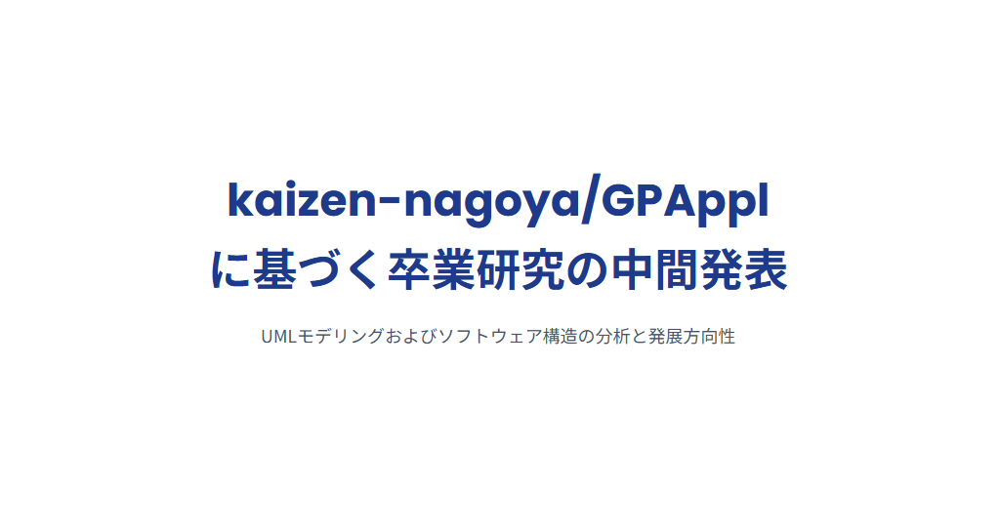
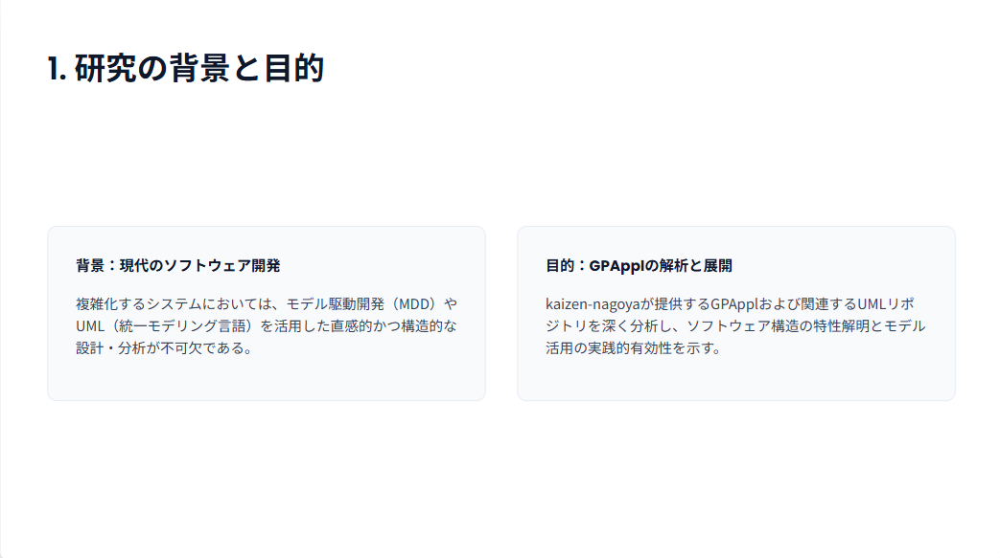
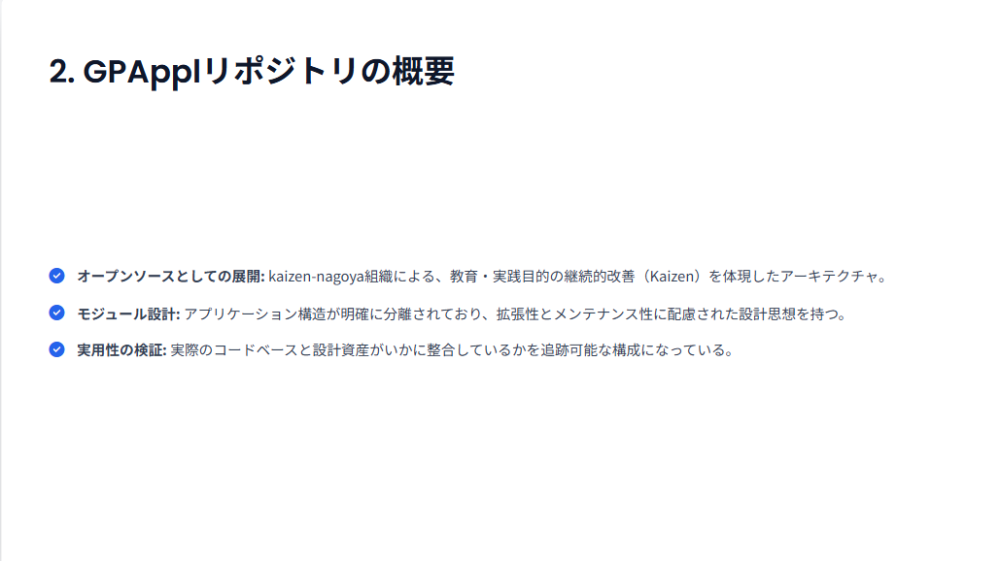
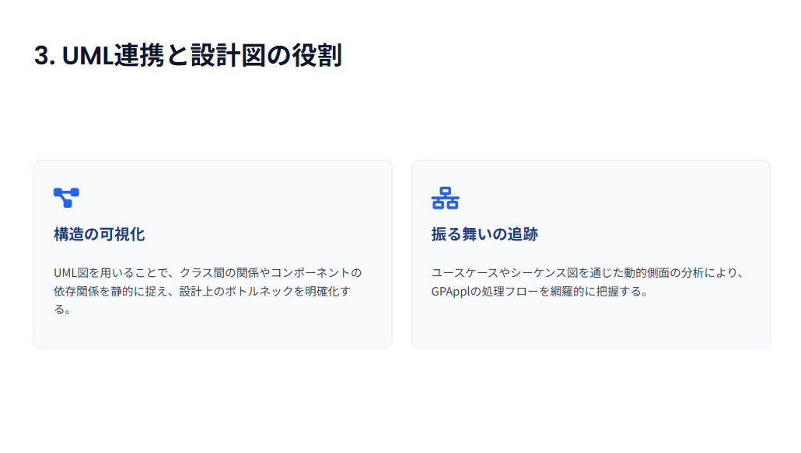
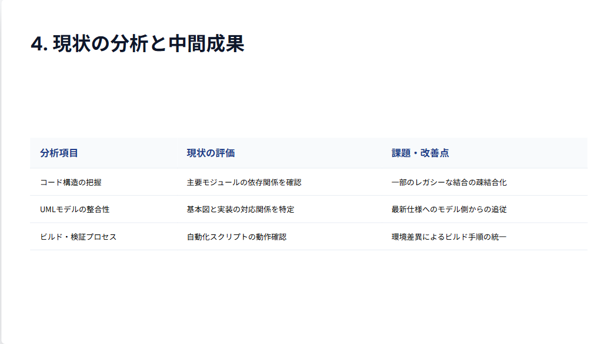
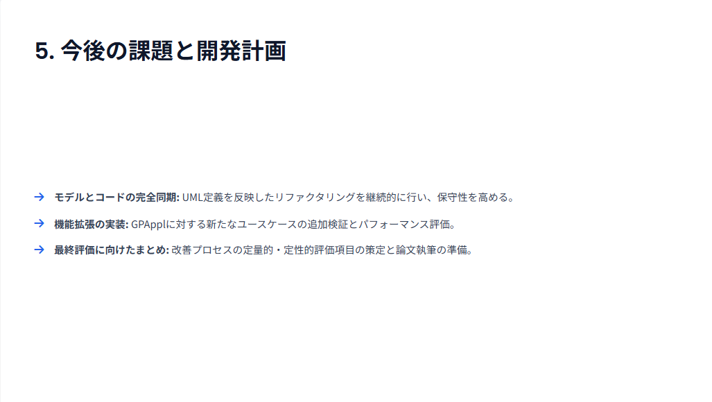
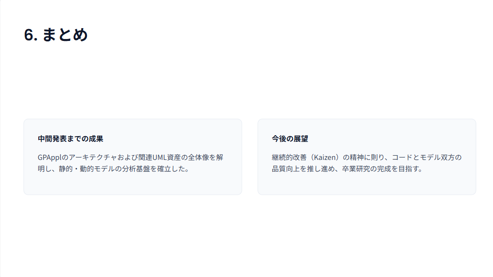
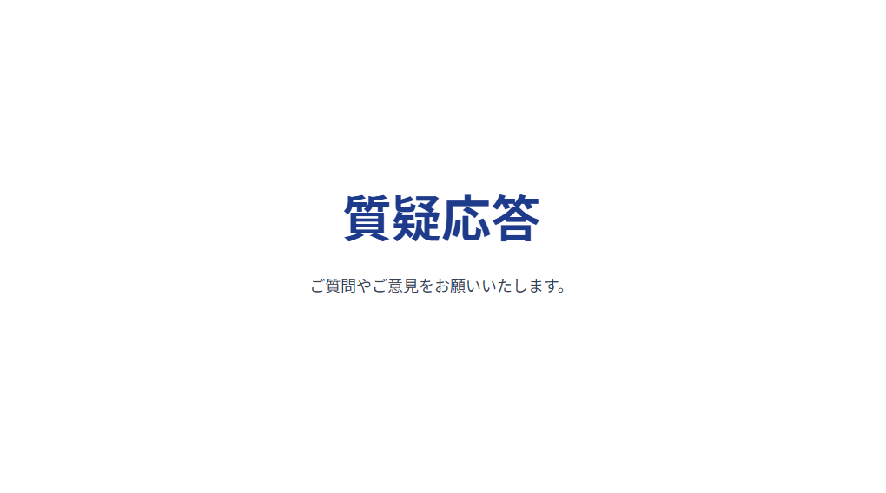

# Q1 kaizen-nagoya/GPAppl の内容を卒業研究にしようと思います。中間発表のスライドを８枚を作成してください。なお、関連URLとして-/UML at main · kaizen-nagoya/- の内容も含みます。
A1 by ChatGPT

Data analysis isn't available right now. Do you want to continue without it?
ファイル、画像、データ分析は、利用上限がリセットされる 14:17まで利用できません。テキストのみでチャットを続けるか、アップグレードして利用枠を増やしてください。

A1 by gemini
Generating slides ...

